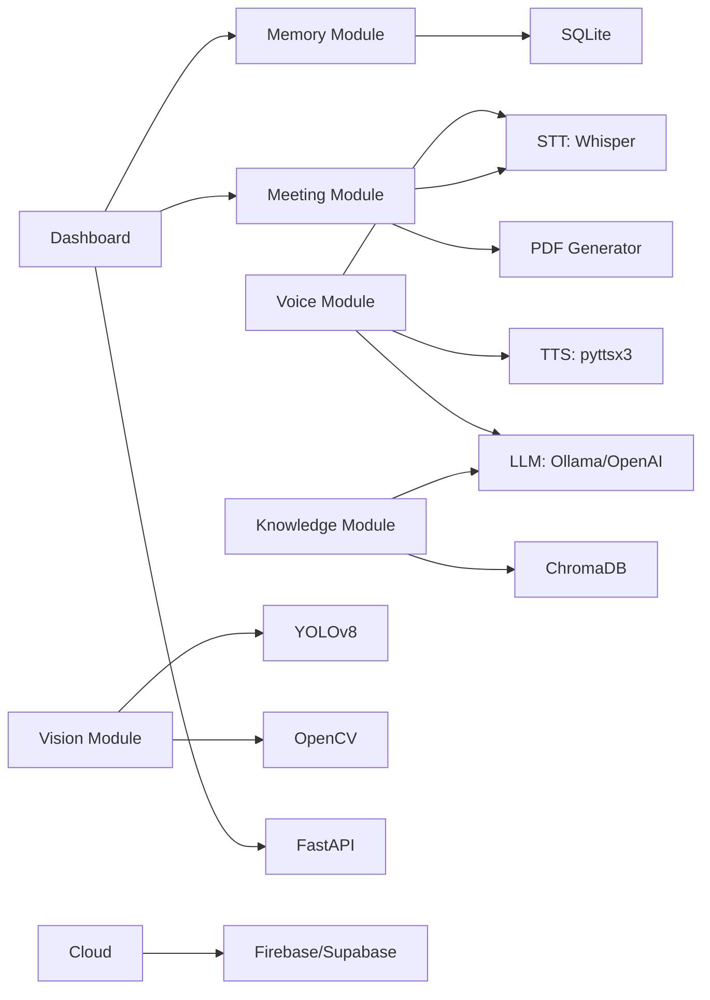

# 01 — Product Requirements Document (PRD)

**Project:** AI Assistant Robot  
**Version:** 1.0  
**Status:** Active  
**Last Updated:** 2024-01  

---

## 1. Problem Statement

Modern workplaces and research environments suffer from a fragmentation of AI tools — transcription, summarization, Q&A, and monitoring all live in separate disconnected applications. Teams lose hours weekly to manual meeting documentation, context switching between tools, and the inability to query institutional knowledge on demand.

Physical robot assistants exist in research labs but are inaccessible to small teams due to cost, complexity, and lack of unified AI intelligence. There is no single, affordable, extensible AI assistant platform that can:

- Conduct natural voice conversations
- Record, transcribe, and summarize meetings automatically
- Answer questions from company documents in real time
- Remember past conversations and user preferences
- Detect objects in its environment
- Be monitored and controlled from a central dashboard

---

## 2. Vision

> **"A single intelligent assistant that watches, listens, remembers, and understands — accessible to any team, deployable on any hardware."**

The AI Assistant Robot will serve as a **unified AI layer** for any workspace — starting as a software-only system running on a laptop, and eventually embedded into a physical robot chassis. It will become the central intelligence hub for meetings, knowledge retrieval, and ambient assistance.

---

## 3. Goals

### Primary Goals

| ID | Goal | Priority |
|----|------|----------|
| G1 | Deliver a fully functional voice-interactive AI assistant | P0 |
| G2 | Automate meeting recording, transcription, summarization, and PDF export | P0 |
| G3 | Enable natural language Q&A over company documents (RAG) | P0 |
| G4 | Implement persistent long-term memory across sessions | P1 |
| G5 | Provide real-time object detection via camera | P1 |
| G6 | Build a live monitoring and control dashboard | P1 |
| G7 | Sync all data to the cloud for backup and remote access | P1 |
| G8 | Design hardware architecture for future physical robot | P2 |

### Secondary Goals

| ID | Goal | Priority |
|----|------|----------|
| G9 | Sound source tracking for directional awareness | P2 |
| G10 | Autonomous docking / self-charging | P2 |

---

## 4. Scope

### In Scope

- **Voice Module:** Wake word detection, STT (Whisper), TTS, conversational AI via LLM
- **Meeting Module:** Audio recording, full transcription, LLM summarization, action item extraction, PDF MoM generation
- **Knowledge Module:** Document ingestion, vector embedding, RAG pipeline, Q&A via ChromaDB + LangChain
- **Memory Module:** SQLite-based persistent conversation memory, user preference storage, meeting history
- **Vision Module:** Real-time YOLO object detection, camera feed processing
- **Expressions Module:** State machine for Listening / Thinking / Speaking / Idle animated states
- **Dashboard:** Streamlit web dashboard with live status, logs, meeting records, memory viewer, system controls
- **Cloud:** Firebase or Supabase integration for storage, sync, and remote access
- **API Layer:** FastAPI backend exposing all module functionality
- **Hardware Design:** CAD and component planning documentation for future physical robot

### Out of Scope (This Release)

| Feature | Reason |
|---------|--------|
| Face Recognition | Privacy complexity; deferred to v2 |
| Navigation / SLAM | Hardware dependency; post-robot migration |
| Pick and Place | Requires arm hardware; out of internship scope |
| Autonomous Exploration | SLAM prerequisite |

---

## 5. Deliverables

| # | Deliverable | Format | Milestone |
|---|-------------|--------|-----------|
| D1 | Voice Assistant Module | Python Package | Week 2 |
| D2 | Meeting Intelligence Pipeline | Python Package + PDF Output | Week 4 |
| D3 | RAG Knowledge System | Python Package + ChromaDB | Week 4 |
| D4 | Long-Term Memory System | SQLite + Python | Week 6 |
| D5 | Object Detection Module | Python + YOLO model | Week 5 |
| D6 | Expressions / Animation Module | Python State Machine | Week 6 |
| D7 | FastAPI Backend | REST API | Week 6 |
| D8 | Streamlit Dashboard | Web App | Week 7 |
| D9 | Cloud Integration | Firebase/Supabase | Week 7 |
| D10 | Full System Integration | Integrated Application | Week 8 |
| D11 | Documentation Suite (20 docs) | Markdown Files | Throughout |
| D12 | Final Demo | Live Presentation | Week 8 |

---

## 6. Success Metrics

### Functional Metrics

| Metric | Target |
|--------|--------|
| Wake word detection accuracy | ≥ 95% in quiet environment |
| Speech-to-text accuracy (Whisper) | ≥ 90% WER on clear speech |
| Meeting transcription completeness | ≥ 95% of words captured |
| RAG answer relevance (user-rated) | ≥ 80% relevant responses |
| Object detection mAP (YOLOv8n COCO) | ≥ 50 mAP@0.5 |
| PDF MoM generation success rate | 100% on valid transcripts |
| Memory recall accuracy | ≥ 90% for stored preferences |

### Performance Metrics

| Metric | Target |
|--------|--------|
| Voice response latency (end-to-end) | < 3 seconds |
| RAG query response time | < 5 seconds |
| Object detection frame rate | ≥ 15 FPS on CPU |
| Dashboard load time | < 2 seconds |
| API response time (p95) | < 500ms |

### User Experience Metrics

| Metric | Target |
|--------|--------|
| Demo scenario completion | 100% of planned demo flow |
| System uptime during demo | ≥ 99% |
| Module restart without data loss | ✅ Required |

---

## 7. User Personas

### Persona 1: The Meeting Organizer (Primary)
- **Name:** Priya, 32, Project Manager
- **Need:** Automatic meeting notes without manual effort
- **Pain Point:** Spends 30 min after every meeting writing notes
- **Use Case:** Starts meeting recording → gets structured PDF MoM automatically

### Persona 2: The Knowledge Worker
- **Name:** Arjun, 28, Engineer
- **Need:** Instant answers from company documents
- **Pain Point:** Can't find information buried in 200-page docs
- **Use Case:** Asks robot a question → gets sourced answer in seconds

### Persona 3: The System Administrator
- **Name:** Mei, 35, IT Lead
- **Need:** Monitor and control the AI system
- **Pain Point:** Black-box AI systems with no visibility
- **Use Case:** Opens dashboard → sees live status, logs, memory state, controls

---

## 8. Assumptions & Dependencies

### Assumptions
- Development is done on a laptop/workstation with Python 3.10+
- Internet access is available for cloud API calls (OpenAI, Firebase)
- Ollama can run local LLM models as a fallback
- A standard USB webcam and microphone are available

### Dependencies

---

## 9. Constraints

| Constraint | Description |
|-----------|-------------|
| Timeline | 2-month internship; strict 8-week delivery |
| Budget | Limited — prefer open-source and free tiers |
| Hardware | Laptop-only for initial development |
| Team | Single intern + mentor oversight |
| API Costs | OpenAI usage should be minimized; Ollama preferred for dev |