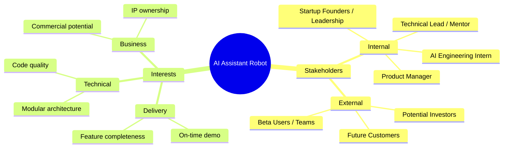
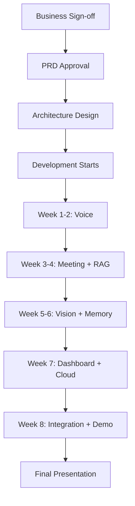

# 02 — Business Requirements Document (BRD)

**Project:** AI Assistant Robot  
**Version:** 1.0  
**Status:** Active  
**Last Updated:** 2024-01  

---

## 1. Executive Summary

This Business Requirements Document defines the business need, stakeholder expectations, use cases, benefits, and constraints for the AI Assistant Robot project. The system is developed as part of a 2-month AI Engineering internship at a robotics startup and is intended to serve as both a deliverable product and a proof-of-concept for future commercial development.

---

## 2. Business Objectives

| ID | Objective | KPI |
|----|-----------|-----|
| BO1 | Demonstrate full AI assistant capabilities in a physical-world context | Feature completeness at demo |
| BO2 | Build reusable modular AI components for future robot products | Module reuse factor ≥ 3 |
| BO3 | Reduce manual effort in meeting documentation for internal teams | 30+ min/meeting saved |
| BO4 | Create a foundation for a commercial AI robot assistant product | Demo attracts investor interest |
| BO5 | Upskill intern in production-grade AI systems engineering | Intern delivers independently |

---

## 3. Stakeholders



### Stakeholder Register

| Stakeholder | Role | Interest | Influence | Communication |
|-------------|------|----------|-----------|---------------|
| AI Engineering Intern | Developer | Deliver features, learn systems | High | Daily standups |
| Technical Lead | Architect / Mentor | Code quality, architecture | High | Weekly review |
| Product Manager | Requirements owner | Feature scope, demo readiness | Medium | Bi-weekly sync |
| Startup Founders | Executive sponsor | Business value, IP | High | Demo presentation |
| Beta Users | End users | Usability, reliability | Medium | Demo feedback |

---

## 4. Use Cases

### UC-01: Voice Q&A Interaction

```
Actor: User
Precondition: Robot system is running, microphone active
Main Flow:
  1. User speaks wake word ("Hey Robot")
  2. System detects wake word, activates listening state
  3. User speaks question
  4. System transcribes speech via Whisper
  5. LLM generates response
  6. TTS speaks the response aloud
  7. System returns to idle state
Alternate Flow:
  3a. No speech detected within 5s → timeout, return to idle
  5a. LLM error → fallback response: "I'm having trouble, please try again"
Postcondition: Interaction logged to memory system
```

### UC-02: Meeting Recording and MoM Generation

```
Actor: Meeting Organizer
Precondition: Meeting in progress, system configured
Main Flow:
  1. User initiates meeting recording via dashboard or voice command
  2. System records audio continuously
  3. Whisper transcribes speech in real-time
  4. On meeting end, LLM summarizes transcript
  5. Action items extracted automatically
  6. PDF MoM generated and saved
  7. Record synced to cloud storage
Alternate Flow:
  2a. Microphone fails → alert on dashboard, log error
  6a. PDF generation fails → raw transcript saved as fallback
Postcondition: PDF MoM available in dashboard and cloud
```

### UC-03: Knowledge Base Q&A (RAG)

```
Actor: Knowledge Worker
Precondition: Documents uploaded to knowledge base
Main Flow:
  1. User asks a question about company documents
  2. System embeds the query
  3. ChromaDB retrieves top-k relevant document chunks
  4. LLM generates answer grounded in retrieved context
  5. Answer delivered with source references
Alternate Flow:
  3a. No relevant chunks found → "I don't have information on that topic"
Postcondition: Q&A interaction logged to session memory
```

### UC-04: Dashboard Monitoring

```
Actor: System Administrator
Precondition: FastAPI backend running
Main Flow:
  1. Admin opens Streamlit dashboard URL
  2. System displays live module status (voice, vision, memory, cloud)
  3. Admin views real-time logs
  4. Admin browses meeting records
  5. Admin inspects memory contents
  6. Admin triggers system actions (restart module, clear memory, etc.)
Postcondition: System state remains consistent
```

### UC-05: Object Detection

```
Actor: Environment Observer
Precondition: Camera connected, YOLO model loaded
Main Flow:
  1. Camera feed active
  2. YOLO model processes each frame
  3. Detected objects annotated with bounding boxes and labels
  4. Detection events logged with timestamps
  5. Dashboard displays live detection feed
Alternate Flow:
  1a. Camera unavailable → dashboard shows "Camera Offline" alert
```

---

## 5. Business Benefits

### Quantitative Benefits

| Benefit | Estimated Value |
|---------|----------------|
| Meeting documentation time saved | 25–35 min per meeting |
| Document search time reduced | 80% reduction vs manual search |
| Meeting action item capture rate | 95%+ vs ~60% manual |
| Prototype cost vs commercial alternatives | ~$500 hardware vs $15,000+ commercial |

### Qualitative Benefits

- **Innovation signal:** Demonstrates startup's AI capability to investors and partners
- **IP creation:** Reusable AI modules with commercial potential
- **Talent development:** Intern gains production-grade AI systems experience
- **Foundation platform:** Architecture designed for future product evolution
- **Competitive differentiation:** Unified AI assistant vs fragmented tools

---

## 6. Constraints

### Business Constraints

| ID | Constraint | Impact |
|----|-----------|--------|
| BC1 | 2-month delivery timeline | Strict prioritization required |
| BC2 | Single developer (intern) | Modules must be developed sequentially |
| BC3 | Limited budget (startup) | Open-source tools preferred |
| BC4 | IP belongs to startup | All code is company property |

### Technical Constraints

| ID | Constraint | Impact |
|----|-----------|--------|
| TC1 | Laptop-only hardware (initially) | No GPU acceleration; CPU-optimized models |
| TC2 | No internet in some demo environments | Local LLM (Ollama) must be available offline |
| TC3 | OpenAI API cost limits | Ollama preferred for development; OpenAI for production |
| TC4 | Single Python runtime | All modules must coexist without conflicts |

### Regulatory/Compliance Constraints

| ID | Constraint | Description |
|----|-----------|-------------|
| RC1 | Audio recording consent | Users must consent before meeting recording begins |
| RC2 | Data storage | Meeting transcripts stored locally; cloud sync requires opt-in |
| RC3 | No face recognition | Explicitly excluded to avoid biometric data regulations |

---

## 7. Assumptions

1. The intern has Python proficiency and basic ML knowledge
2. Mentor availability for weekly architecture reviews
3. OpenAI API key available for production features
4. Porcupine (Picovoice) free tier sufficient for wake word
5. Firebase or Supabase free tier sufficient for demo-scale cloud storage
6. Demo environment has stable WiFi and adequate hardware (8GB+ RAM)

---

## 8. Dependencies



---

## 9. Risk Summary

| Risk | Probability | Impact | Mitigation |
|------|-------------|--------|-----------|
| LLM API costs exceed budget | Medium | High | Use Ollama locally; monitor token usage |
| Whisper STT performance on noisy audio | Medium | Medium | Add audio preprocessing, noise filtering |
| YOLO too slow on CPU | High | Medium | Use YOLOv8n (nano) model; reduce resolution |
| Timeline slippage | Medium | High | Prioritize P0 features; P2+ can be cut |
| Cloud integration blocked by network policy | Low | Medium | Test Firebase early; Supabase as backup |

---

## 10. Sign-off

| Role | Name | Date | Signature |
|------|------|------|-----------|
| AI Engineering Intern | | | |
| Technical Lead | | | |
| Product Manager | | | |