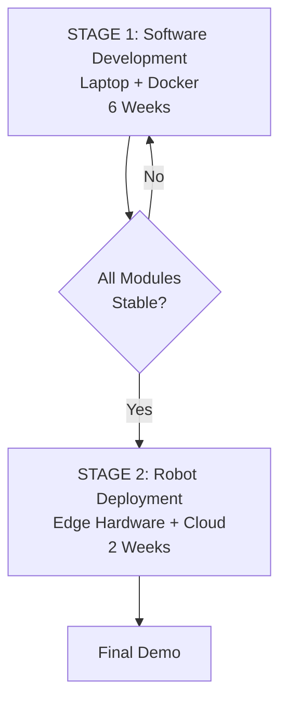

# 02 — Project Workflow

**Version:** 1.0

---

## 1. Development Philosophy

> **Software First. Hardware Second.**
> Every module is built, tested, and validated on a laptop before any hardware integration. The laptop IS the robot brain during Stage 1.

---

## 2. Two-Stage Overview



---

## 3. Development Phases

### Phase 1 — Foundation & Architecture (Week 1)

**Goal:** Set up the complete project skeleton before writing any AI code.

```
Tasks:
├── Initialize Git repository
├── Create Docker Compose multi-service setup
├── Scaffold FastAPI gateway service
├── Set up Streamlit dashboard skeleton
├── Initialize SQLite databases
├── Initialize ChromaDB vector store
├── Set up Ollama with LLaMA model
├── Write base config files (settings.yaml)
└── Verify all services start cleanly
```

**Deliverable:** `docker-compose up` starts all services, all health checks pass.

---

### Phase 2 — Voice Assistant (Week 1–2)

**Goal:** Robot can listen, think, and respond by voice.

```
Tasks:
├── Integrate Porcupine wake word detection
├── Set up Whisper STT (tiny model first)
├── Connect Ollama LLaMA for response generation
├── Integrate Piper TTS for speech output
├── Test full pipeline: speak → robot responds
└── Connect to dashboard: show transcript live
```

**Deliverable:** Say wake word → robot answers a question out loud.

---

### Phase 3 — Speech Recognition (Week 2)

**Goal:** Robust, accurate transcription pipeline.

```
Tasks:
├── Upgrade Whisper model (base → small based on perf)
├── Add Voice Activity Detection (VAD)
├── Handle background noise scenarios
├── Add language detection
└── Benchmark WER (Word Error Rate)
```

**Deliverable:** Transcription accuracy > 85% on clear audio.

---

### Phase 4 — Meeting Transcription (Week 3)

**Goal:** Record and transcribe full meetings with speaker labels.

```
Tasks:
├── Build meeting record/stop command via voice
├── Implement streaming Whisper transcription
├── Integrate pyannote.audio for speaker diarization
├── Save transcript to SQLite
└── Display live transcript in dashboard
```

**Deliverable:** 30-minute mock meeting fully transcribed with speaker labels.

---

### Phase 5 — Meeting Summarization (Week 3)

**Goal:** Auto-generate structured summaries and PDF minutes.

```
Tasks:
├── Build LLaMA summarization prompt template
├── Extract: summary, action items, decisions
├── Generate PDF using reportlab
├── Save PDF path to database
└── Make PDF downloadable from dashboard
```

**Deliverable:** Post-meeting PDF with summary, action items, decisions.

---

### Phase 6 — Knowledge AI / RAG (Week 4)

**Goal:** Answer questions from uploaded documents.

```
Tasks:
├── Build document ingestion pipeline (PDF, TXT)
├── Chunk documents and embed with sentence-transformers
├── Store embeddings in ChromaDB
├── Build retrieval chain (LangChain)
├── Connect to LLaMA for answer generation
└── Add source citation in responses
```

**Deliverable:** Upload a PDF → ask questions → get grounded answers with citations.

---

### Phase 7 — Long-Term Memory (Week 4–5)

**Goal:** Robot remembers past conversations and user preferences.

```
Tasks:
├── Design conversation memory schema
├── Store every conversation turn in SQLite
├── Retrieve relevant past context for LLM prompts
├── Build user profile (preferences, name, history)
└── Test: robot recalls facts from 2 days ago
```

**Deliverable:** Robot remembers user name and preferences across sessions.

---

### Phase 8 — Object Detection (Week 5)

**Goal:** Detect and classify objects in camera feed.

```
Tasks:
├── Integrate OpenCV camera capture
├── Load YOLOv8-nano model
├── Run inference on live frames
├── Draw bounding boxes on stream
├── Log detections to database
└── Stream annotated feed to dashboard
```

**Deliverable:** Live camera feed with real-time object labels on dashboard.

---

### Phase 9 — Expression Engine (Week 5–6)

**Goal:** Robot displays contextual expressions/animations.

```
Tasks:
├── Define expression states (idle, listening, thinking...)
├── Build expression UI in Streamlit/HTML
├── Connect state manager to all modules
└── Test expression changes with voice pipeline
```

**Deliverable:** Dashboard shows robot face changing expression based on activity.

---

### Phase 10 — Dashboard (Week 6)

**Goal:** Full monitoring and control from one interface.

```
Tasks:
├── Integrate all module outputs into Streamlit
├── Add live camera + detection feed
├── Add conversation history panel
├── Add meeting records browser
├── Add system health monitor
└── Add manual controls (start/stop meeting, etc.)
```

**Deliverable:** Single dashboard showing all robot activity.

---

### Phase 11 — Cloud Integration (Week 7)

**Goal:** Sync data to cloud, enable remote access.

```
Tasks:
├── Design cloud storage schema (S3-compatible)
├── Build meeting record sync service
├── Build knowledge base backup service
├── Add remote dashboard access
└── Test cloud-agnostic deployment
```

**Deliverable:** Meeting PDFs automatically synced to cloud storage.

---

### Phase 12 — System Orchestrator (Week 7)

**Goal:** Single orchestration layer coordinates all modules.

```
Tasks:
├── Build central AI orchestrator service
├── Define intent routing logic
├── Connect all modules via internal API
├── Handle concurrent requests
└── Add fallback and error handling
```

**Deliverable:** One entry point routes any input to the correct module.

---

### Phase 13 — Hardware Migration (Week 8)

**Goal:** Move software to edge hardware.

```
Tasks:
├── Test Docker containers on Raspberry Pi
├── Optimize models for ARM (quantization)
├── Connect physical mic, camera, speaker
├── Validate all modules on Pi hardware
└── Performance benchmarks on Pi
```

**Deliverable:** Robot physically running all Stage 1 modules.

---

### Phase 14 — Testing (Week 8)

```
Tasks:
├── Unit tests for each module
├── Integration tests for full pipeline
├── Load tests for API endpoints
├── End-to-end demo scenario tests
└── Performance benchmarks
```

---

### Phase 15 — Deployment & Demo (Week 8)

```
Tasks:
├── Final docker-compose production config
├── Write deployment guide
├── Prepare demo script
└── Record demo video
```

---

## 4. Git Branching Strategy

```
main
  └── develop
        ├── feature/voice-assistant
        ├── feature/speech-recognition
        ├── feature/meeting-transcription
        ├── feature/meeting-summarization
        ├── feature/knowledge-rag
        ├── feature/memory-system
        ├── feature/object-detection
        ├── feature/expression-engine
        ├── feature/dashboard
        ├── feature/cloud-integration
        └── feature/orchestrator
```

**Rules:**
- Never commit directly to `main`
- Each phase = one feature branch
- Merge to `develop` when phase is complete
- Merge to `main` only for stable releases

---

## 5. Daily Workflow

```
Morning:
  1. Pull latest from develop
  2. Review today's tasks from phase plan
  3. Start feature branch if new phase

Development:
  1. Write module code
  2. Test locally (docker-compose up)
  3. Write unit test
  4. Commit with clear message: feat/fix/docs/test

Evening:
  1. Push branch
  2. Update progress notes
  3. Note blockers for next day
```

---

## 6. Testing Gates

Before moving to the next phase, the current phase must pass:

| Gate | Check |
|---|---|
| Unit Tests | All passing |
| Integration | Module connects to FastAPI cleanly |
| Dashboard | Output visible in Streamlit |
| Performance | Meets latency target |
| Docker | Service runs cleanly in container |

---

*Project Workflow v1.0 — AI Assistant Robot*