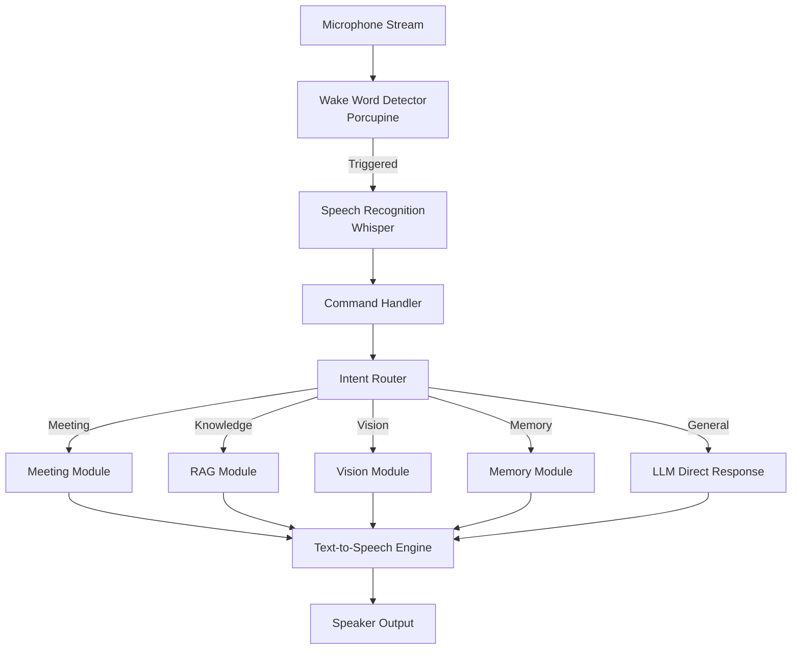
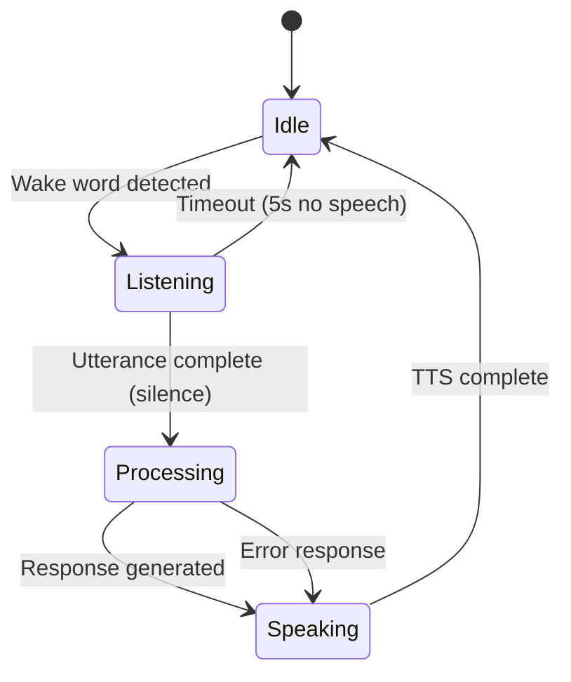
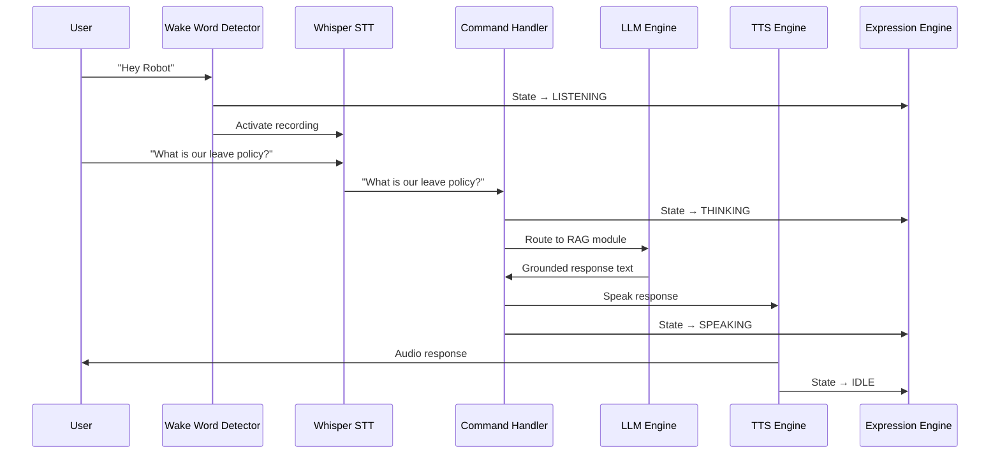

# 04 — Voice Assistant

**Module:** Voice Assistant
**Phase:** 2
**Dependencies:** Phase 1 (Foundation)

---

## 1. Voice Assistant Architecture

The Voice Assistant module is the primary interface between the user and the AI Robot. It consists of three sub-systems:

- **Wake Word Detector** — always-on listener for the trigger phrase
- **Text-to-Speech (TTS) Engine** — converts robot responses to audio
- **Command Handler** — routes recognized intents to appropriate modules



---

## 2. Wake Word Design

### Technology Choice

| Option | Pros | Cons | Selected |
|--------|------|------|----------|
| Porcupine (pvporcupine) | Offline, low CPU, accurate | Free tier limits | ✅ Yes |
| Snowboy | Open source | Deprecated | No |
| Vosk KWS | Free, offline | Less accurate | Backup |
| Custom (TensorFlow) | Fully custom | High effort | Future |

### Wake Word Configuration

```python
# config/settings.py
WAKE_WORD = "hey robot"          # Configurable
WAKE_WORD_SENSITIVITY = 0.5     # 0.0 (low) to 1.0 (high sensitivity)
WAKE_WORD_MODEL_PATH = "models/hey_robot.ppn"
```

### Wake Word Detection Loop

```python
# src/voice/wake_word.py
import pvporcupine
import pyaudio
import struct

class WakeWordDetector:
    def __init__(self, keyword_path, sensitivity=0.5):
        self.porcupine = pvporcupine.create(
            keyword_paths=[keyword_path],
            sensitivities=[sensitivity]
        )
        self.pa = pyaudio.PyAudio()

    def listen(self, on_detected_callback):
        stream = self.pa.open(
            rate=self.porcupine.sample_rate,
            channels=1,
            format=pyaudio.paInt16,
            input=True,
            frames_per_buffer=self.porcupine.frame_length
        )
        while True:
            pcm = stream.read(self.porcupine.frame_length)
            pcm = struct.unpack_from("h" * self.porcupine.frame_length, pcm)
            keyword_index = self.porcupine.process(pcm)
            if keyword_index >= 0:
                on_detected_callback()
```

---

## 3. Text-to-Speech (TTS) Engine

### Technology Choice

| Option | Quality | Latency | Offline | Selected |
|--------|---------|---------|---------|----------|
| pyttsx3 | Basic | Very low | Yes | ✅ Primary |
| gTTS (Google) | Good | Medium | No | Fallback |
| ElevenLabs | Excellent | Medium | No | Premium |
| Coqui TTS | Good | Low | Yes | Alternative |

### TTS Implementation

```python
# src/voice/tts.py
import pyttsx3
from enum import Enum

class TTSEngine:
    def __init__(self, rate=175, volume=0.9, voice_gender="male"):
        self.engine = pyttsx3.init()
        self.engine.setProperty('rate', rate)
        self.engine.setProperty('volume', volume)
        self._set_voice(voice_gender)

    def speak(self, text: str):
        self.engine.say(text)
        self.engine.runAndWait()

    def speak_async(self, text: str):
        # For non-blocking TTS
        import threading
        t = threading.Thread(target=self.speak, args=(text,))
        t.start()
```

---

## 4. Command Handler

### Intent Classification

The command handler uses keyword matching + LLM intent detection:

```python
# src/voice/command_handler.py
INTENT_PATTERNS = {
    "meeting_start":   ["start recording", "begin meeting", "record meeting"],
    "meeting_stop":    ["stop recording", "end meeting"],
    "meeting_summary": ["summarize", "summary", "what happened"],
    "knowledge_query": ["what is", "what are", "policy", "document", "tell me about"],
    "vision_query":    ["what do you see", "look around", "describe"],
    "memory_query":    ["remember", "what did I say", "my favorite"],
    "greeting":        ["hello", "hi", "hey"],
    "farewell":        ["bye", "goodbye", "see you"],
}

class CommandHandler:
    def route(self, text: str) -> dict:
        text_lower = text.lower()
        for intent, patterns in INTENT_PATTERNS.items():
            if any(p in text_lower for p in patterns):
                return {"intent": intent, "text": text}
        return {"intent": "general", "text": text}
```

---

## 5. Conversational Flow



### Multi-Turn Conversation

```python
class ConversationManager:
    def __init__(self):
        self.history = []       # Short-term in-session history
        self.max_history = 10   # Rolling window

    def add_turn(self, role: str, content: str):
        self.history.append({"role": role, "content": content})
        if len(self.history) > self.max_history * 2:
            self.history = self.history[-self.max_history * 2:]

    def get_context(self) -> list:
        return self.history
```

---

## 6. Error Handling

| Error | Detection | Recovery |
|-------|-----------|----------|
| No audio input | Stream read timeout | "I didn't catch that, please repeat." |
| Wake word false positive | Low confidence score | Re-listen for command |
| STT failure | Whisper exception | "Sorry, I couldn't understand that." |
| LLM timeout | Request timeout (10s) | "Thinking... please wait." |
| TTS failure | pyttsx3 exception | Log error, continue silently |
| Module unavailable | Module health check | "That feature is currently unavailable." |

---

## 7. Full Sequence Diagram



---

## 8. Configuration Reference

```python
# config/settings.py

# Wake Word
WAKE_WORD_ENABLED = True
WAKE_WORD_KEYWORD = "hey robot"
WAKE_WORD_SENSITIVITY = 0.5

# TTS
TTS_ENGINE = "pyttsx3"     # Options: pyttsx3, gtts, elevenlabs
TTS_RATE = 175             # Words per minute
TTS_VOLUME = 0.9           # 0.0 to 1.0

# Conversation
MAX_HISTORY_TURNS = 10
COMMAND_TIMEOUT_SECONDS = 5
LLM_TIMEOUT_SECONDS = 10
```

---

## 9. Future Improvements

- Custom wake word trained on "Hey Robot" with personal voice model
- Multi-language TTS support
- Emotion-aware voice modulation (excited, calm, apologetic)
- Voice activity detection (VAD) for better end-of-utterance detection
- Speaker diarization for meeting transcription (who said what)