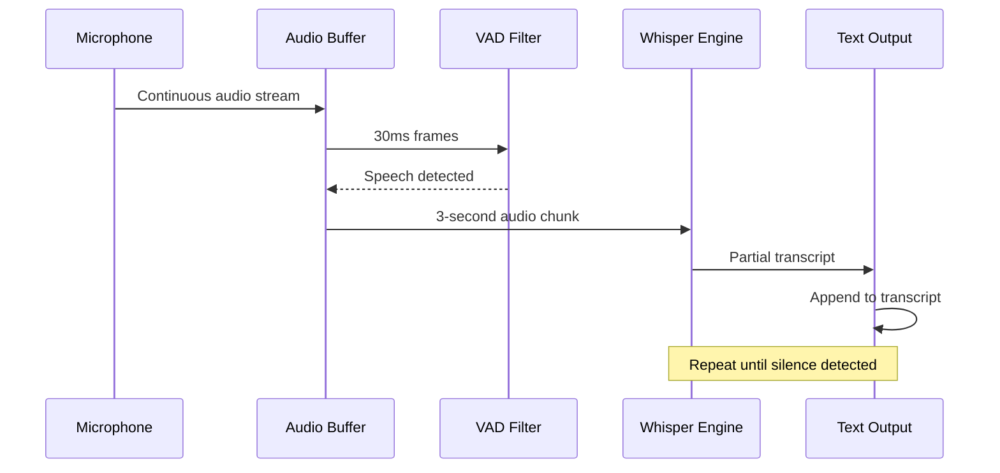
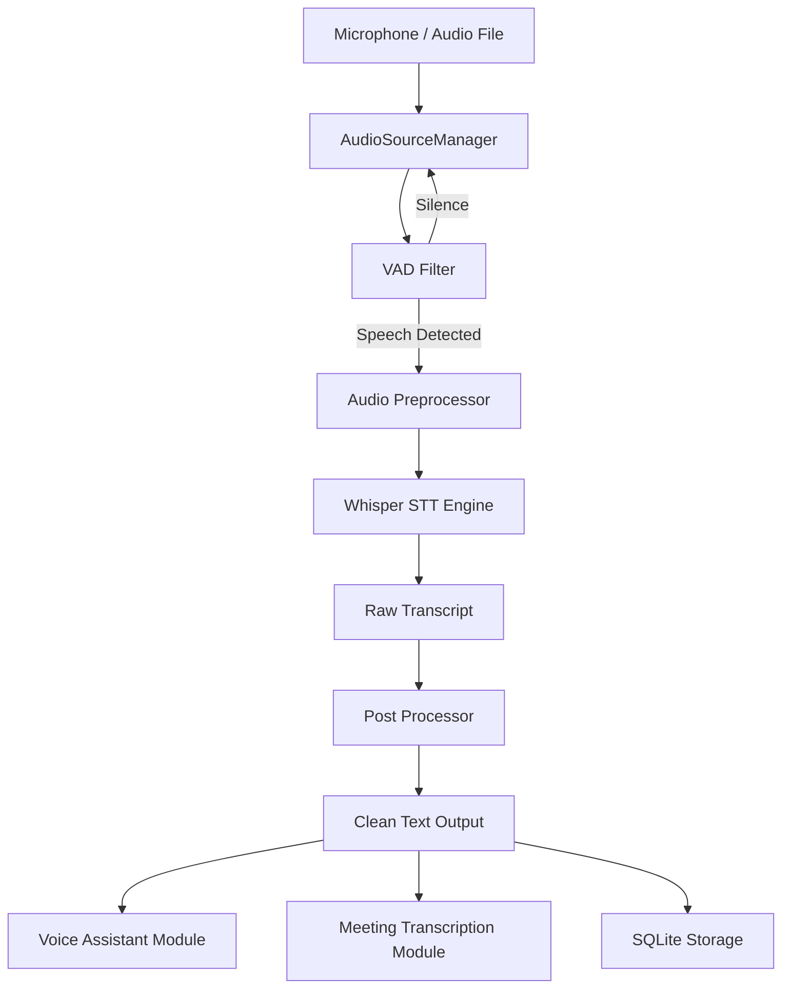

# 05 — Speech Recognition

---

## Purpose

Define the architecture, pipeline, and implementation strategy for the Speech Recognition module — responsible for converting live and recorded audio into accurate text transcripts used by the AI orchestrator, meeting pipeline, and all downstream modules.

---

## Scope

| In Scope | Out of Scope |
|---|---|
| Real-time microphone STT | Speaker diarization (Phase 2) |
| File-based audio transcription | Custom acoustic model training |
| Whisper model integration | Multilingual auto-detection (optional) |
| VAD (Voice Activity Detection) | Cloud STT APIs |
| Noise preprocessing | Hardware mic array beamforming |
| Language: English (primary) | Emotion detection from speech |

---

## Architecture Overview

```
┌─────────────────────────────────────────────────────────────┐
│                   SPEECH RECOGNITION MODULE                  │
│                                                             │
│  ┌──────────┐    ┌──────────┐    ┌──────────┐    ┌───────┐ │
│  │  Audio   │───▶│   VAD    │───▶│Preprocess│───▶│Whisper│ │
│  │  Source  │    │ Filter   │    │  Engine  │    │  STT  │ │
│  └──────────┘    └──────────┘    └──────────┘    └───────┘ │
│       │                                               │      │
│  ┌────▼────┐                                   ┌─────▼────┐ │
│  │  Live   │                                   │  Text    │ │
│  │  File   │                                   │  Output  │ │
│  └─────────┘                                   └──────────┘ │
└─────────────────────────────────────────────────────────────┘
```

---

## Component Descriptions

### 1. Audio Source Manager

Handles two input modes:

**Live Mode** — Captures continuous audio from system microphone in real-time chunks.

**File Mode** — Accepts `.wav`, `.mp3`, `.m4a`, `.ogg` files for batch transcription.

```python
class AudioSourceManager:
    LIVE_MODE = "live"
    FILE_MODE = "file"
    SAMPLE_RATE = 16000
    CHUNK_DURATION_SEC = 3
    CHANNELS = 1
```

---

### 2. Voice Activity Detection (VAD)

Filters silence and background noise before passing audio to Whisper. Prevents wasted inference on non-speech segments.

**Library:** `webrtcvad` or `silero-vad`

| Parameter | Value |
|---|---|
| Frame duration | 30ms |
| Aggressiveness | 2 (0–3 scale) |
| Min speech duration | 300ms |
| Silence padding | 500ms |

---

### 3. Audio Preprocessor

Normalizes audio signal before STT inference.

Operations:
- Resample to 16 kHz mono
- Normalize amplitude (peak -3dBFS)
- Apply low-pass filter (cutoff: 8 kHz)
- Remove DC offset

```python
import librosa
import numpy as np

def preprocess_audio(audio: np.ndarray, sr: int) -> np.ndarray:
    audio = librosa.resample(audio, orig_sr=sr, target_sr=16000)
    audio = librosa.util.normalize(audio)
    return audio
```

---

### 4. Whisper STT Engine

Core transcription engine using OpenAI Whisper running fully locally via Ollama or direct `openai-whisper` Python package.

**Model Selection:**

| Model | Size | Speed | Accuracy | Recommended Use |
|---|---|---|---|---|
| tiny | 39M | Fastest | Low | Testing only |
| base | 74M | Fast | Medium | Development |
| small | 244M | Medium | Good | Stage 1 |
| medium | 769M | Slow | Very Good | Production |
| large-v3 | 1550M | Slowest | Best | Final deploy |

> **Default for Stage 1:** `small` or `medium` depending on hardware.

```python
import whisper

class WhisperSTTEngine:
    def __init__(self, model_name: str = "small"):
        self.model = whisper.load_model(model_name)

    def transcribe(self, audio_path: str) -> dict:
        result = self.model.transcribe(
            audio_path,
            language="en",
            task="transcribe",
            verbose=False
        )
        return {
            "text": result["text"],
            "segments": result["segments"],
            "language": result["language"]
        }
```

---

### 5. Streaming Transcription Handler

For real-time voice assistant use — streams audio in chunks and returns partial transcripts.



---

### 6. Transcript Post-Processor

Cleans raw Whisper output:
- Remove filler words: "um", "uh", "you know"
- Fix punctuation
- Capitalize proper nouns
- Detect and mark speaker turns (basic)

---

## Data Flow



---

## API Design

### Endpoints

```
POST /api/v1/stt/transcribe-file
POST /api/v1/stt/start-live
POST /api/v1/stt/stop-live
GET  /api/v1/stt/status
GET  /api/v1/stt/transcript/{session_id}
```

### Request — File Transcription

```json
POST /api/v1/stt/transcribe-file
Content-Type: multipart/form-data

{
  "audio_file": <binary>,
  "language": "en",
  "model": "small",
  "task": "transcribe"
}
```

### Response

```json
{
  "session_id": "stt_20240901_143000",
  "status": "completed",
  "transcript": "Good morning everyone. Today we will discuss...",
  "segments": [
    {
      "id": 0,
      "start": 0.0,
      "end": 3.2,
      "text": "Good morning everyone."
    }
  ],
  "language": "en",
  "duration_sec": 120.5,
  "processing_time_sec": 8.3
}
```

---

## Database Schema

```sql
CREATE TABLE transcription_sessions (
    id INTEGER PRIMARY KEY AUTOINCREMENT,
    session_id TEXT UNIQUE NOT NULL,
    source_type TEXT CHECK(source_type IN ('live', 'file')),
    audio_filename TEXT,
    transcript_raw TEXT,
    transcript_clean TEXT,
    language TEXT DEFAULT 'en',
    model_used TEXT,
    duration_sec REAL,
    processing_time_sec REAL,
    word_count INTEGER,
    created_at DATETIME DEFAULT CURRENT_TIMESTAMP
);

CREATE TABLE transcript_segments (
    id INTEGER PRIMARY KEY AUTOINCREMENT,
    session_id TEXT,
    segment_index INTEGER,
    start_time REAL,
    end_time REAL,
    text TEXT,
    confidence REAL,
    FOREIGN KEY (session_id) REFERENCES transcription_sessions(session_id)
);
```

---

## Service Architecture (Docker)

```yaml
# docker-compose excerpt
stt-service:
  build: ./services/stt
  ports:
    - "8002:8002"
  volumes:
    - ./models/whisper:/models
    - ./data/audio:/audio
  environment:
    - WHISPER_MODEL=small
    - DEVICE=cpu
  devices:
    - /dev/snd  # audio device passthrough
```

---

## Directory Structure

```
services/stt/
├── main.py                  # FastAPI app
├── audio_source.py          # Mic and file input
├── vad_filter.py            # Voice activity detection
├── preprocessor.py          # Audio normalization
├── whisper_engine.py        # Whisper wrapper
├── post_processor.py        # Text cleanup
├── models/
│   └── whisper/             # Downloaded model weights
├── tests/
│   ├── test_vad.py
│   ├── test_whisper.py
│   └── sample_audio/
└── requirements.txt
```

---

## Design Decisions

| Decision | Choice | Reason |
|---|---|---|
| STT Engine | Whisper | Local, no API cost, high accuracy |
| Model default | small/medium | Balance of speed vs accuracy |
| VAD library | webrtcvad | Lightweight, real-time capable |
| Audio format | 16kHz mono WAV | Whisper's native format |
| Streaming approach | Chunk-based | Avoids long latency |
| Language | English default | Simplifies model selection |

---

## Performance Benchmarks (Approximate)

| Model | RTF* (CPU) | RTF* (GPU) | WER English |
|---|---|---|---|
| tiny | 0.3x | 0.05x | ~15% |
| small | 1.2x | 0.2x | ~8% |
| medium | 3x | 0.5x | ~5% |
| large-v3 | 6x | 1x | ~3% |

*RTF = Real Time Factor. RTF < 1.0 = faster than real-time.

---

## Future Scalability

- Replace `webrtcvad` with `silero-vad` for better accuracy
- Add speaker diarization using `pyannote.audio`
- GPU acceleration via CUDA for sub-real-time processing
- Whisper.cpp for embedded edge devices (Jetson/RPi)
- Multilingual model auto-selection based on detected language
- Streaming WebSocket endpoint for real-time partial results

---

## Implementation Notes

1. Always resample audio to 16kHz before passing to Whisper
2. Use `fp16=False` on CPU-only machines to avoid errors
3. Segment timestamps are useful for meeting module alignment
4. Save raw + cleaned transcripts separately in DB
5. Implement retry logic if Whisper model fails to load
6. Audio buffer should auto-flush after 30 seconds of silence in live mode