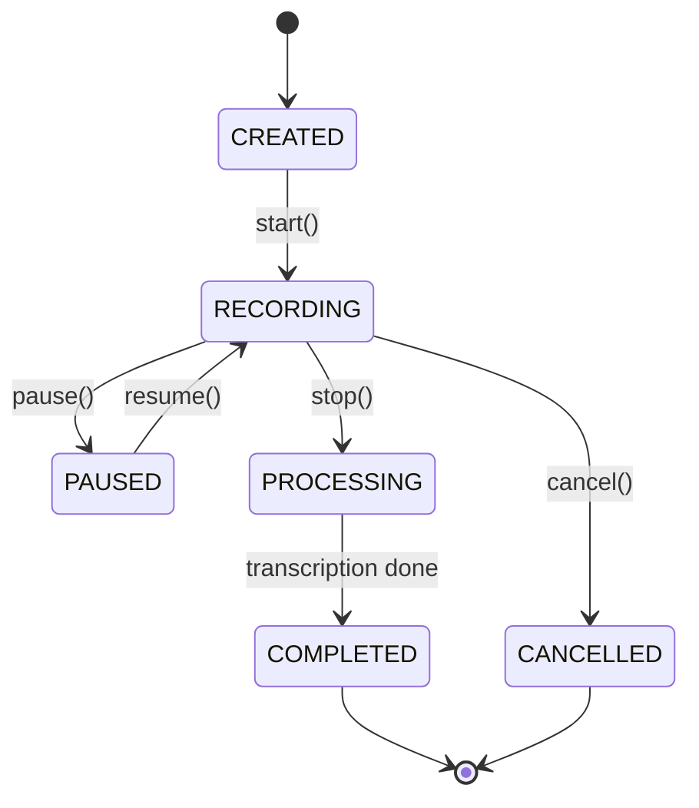
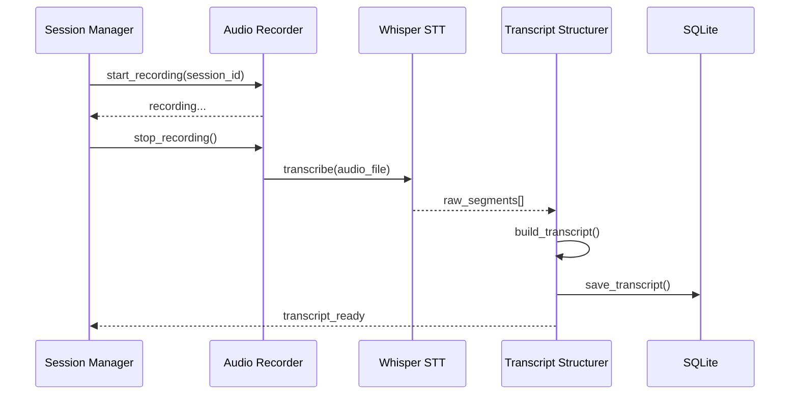
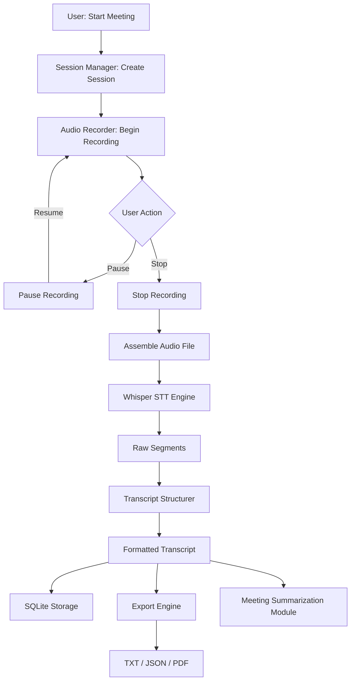

# 06 — Meeting Transcription

---

## Purpose

Define the architecture and pipeline for the Meeting Transcription module — responsible for recording full meetings, converting audio to structured transcripts with speaker turns, timestamps, and session metadata for downstream summarization and MoM generation.

---

## Scope

| In Scope | Out of Scope |
|---|---|
| Full session audio recording | Real-time captioning display |
| Multi-segment transcription | Speaker identification by voice |
| Timestamped transcript generation | Video recording |
| Session management (start/stop/pause) | Cloud streaming transcription |
| Export to TXT, JSON, PDF | Multi-room meeting support |
| Integration with Summarization module | Calendar integration |

---

## Architecture Overview

```
┌──────────────────────────────────────────────────────────────────┐
│                  MEETING TRANSCRIPTION MODULE                    │
│                                                                  │
│  ┌──────────┐  ┌──────────┐  ┌──────────┐  ┌────────────────┐  │
│  │ Session  │  │  Audio   │  │ Whisper  │  │  Transcript    │  │
│  │ Manager  │─▶│ Recorder │─▶│   STT    │─▶│  Structurer   │  │
│  └──────────┘  └──────────┘  └──────────┘  └────────────────┘  │
│       │                                              │            │
│  ┌────▼────┐                               ┌─────────▼────────┐ │
│  │  DB     │                               │  Export Engine   │ │
│  │ Storage │                               │  TXT / JSON / PDF│ │
│  └─────────┘                               └──────────────────┘ │
└──────────────────────────────────────────────────────────────────┘
```

---

## Component Descriptions

### 1. Session Manager

Controls meeting lifecycle — creates, tracks, pauses, and closes meeting sessions.

```python
class MeetingSession:
    session_id: str         # UUID
    title: str
    participants: List[str]
    start_time: datetime
    end_time: datetime
    status: str             # active | paused | completed
    audio_file_path: str
    transcript_path: str
```

**State Machine:**



---

### 2. Audio Recorder

Records meeting audio in chunks and assembles into a single session file.

```python
import pyaudio
import wave

class AudioRecorder:
    CHUNK = 1024
    FORMAT = pyaudio.paInt16
    CHANNELS = 1
    RATE = 16000

    def record(self, output_path: str, stop_event: threading.Event):
        """Records until stop_event is set."""
        ...
```

**Chunk Strategy:**
- Records in 10-second rolling chunks
- Assembles all chunks at session end
- Keeps interim files in case of crash recovery

---

### 3. Transcription Pipeline

Calls the STT module (Whisper) on the complete meeting audio file.



---

### 4. Transcript Structurer

Converts Whisper's raw segment array into a structured, readable transcript.

**Input (Whisper raw):**
```json
[
  {"start": 0.0, "end": 4.2, "text": " Good morning everyone."},
  {"start": 4.5, "end": 9.1, "text": " Today we will discuss the Q3 report."}
]
```

**Output (Structured):**
```
[00:00:00] Good morning everyone.
[00:00:04] Today we will discuss the Q3 report.
```

**Optional Speaker Labels (Basic):**

When multiple audio tracks are available:
```
[00:00:00] [SPEAKER_1] Good morning everyone.
[00:00:04] [SPEAKER_2] Today we will discuss the Q3 report.
```

---

### 5. Export Engine

Generates transcript files in multiple formats.

| Format | Use Case |
|---|---|
| `.txt` | Quick reading |
| `.json` | Machine processing, MoM |
| `.pdf` | Archiving, sharing |
| `.srt` | Subtitle format |

```python
class TranscriptExporter:
    def export_txt(self, session_id: str) -> str: ...
    def export_json(self, session_id: str) -> dict: ...
    def export_pdf(self, session_id: str) -> bytes: ...
    def export_srt(self, session_id: str) -> str: ...
```

---

## Data Flow



---

## Database Schema

```sql
CREATE TABLE meeting_sessions (
    id INTEGER PRIMARY KEY AUTOINCREMENT,
    session_id TEXT UNIQUE NOT NULL,
    title TEXT,
    description TEXT,
    participants TEXT,              -- JSON array
    start_time DATETIME,
    end_time DATETIME,
    duration_sec REAL,
    status TEXT DEFAULT 'created',
    audio_file_path TEXT,
    audio_size_bytes INTEGER,
    transcript_raw TEXT,
    transcript_structured TEXT,
    word_count INTEGER,
    model_used TEXT,
    created_at DATETIME DEFAULT CURRENT_TIMESTAMP,
    updated_at DATETIME DEFAULT CURRENT_TIMESTAMP
);

CREATE TABLE meeting_segments (
    id INTEGER PRIMARY KEY AUTOINCREMENT,
    session_id TEXT NOT NULL,
    segment_index INTEGER,
    start_time REAL,
    end_time REAL,
    speaker TEXT DEFAULT 'SPEAKER_1',
    text TEXT,
    FOREIGN KEY (session_id) REFERENCES meeting_sessions(session_id)
);

CREATE TABLE meeting_exports (
    id INTEGER PRIMARY KEY AUTOINCREMENT,
    session_id TEXT NOT NULL,
    export_format TEXT,
    file_path TEXT,
    exported_at DATETIME DEFAULT CURRENT_TIMESTAMP,
    FOREIGN KEY (session_id) REFERENCES meeting_sessions(session_id)
);
```

---

## API Design

```
POST   /api/v1/meeting/start
POST   /api/v1/meeting/{session_id}/stop
POST   /api/v1/meeting/{session_id}/pause
POST   /api/v1/meeting/{session_id}/resume
GET    /api/v1/meeting/{session_id}/status
GET    /api/v1/meeting/{session_id}/transcript
POST   /api/v1/meeting/upload-audio        # Upload existing audio
GET    /api/v1/meeting/{session_id}/export?format=pdf
GET    /api/v1/meeting/list
DELETE /api/v1/meeting/{session_id}
```

### Start Meeting Request

```json
POST /api/v1/meeting/start
{
  "title": "Q3 Planning Meeting",
  "participants": ["Alice", "Bob", "Carol"],
  "description": "Quarterly planning and review"
}
```

### Response

```json
{
  "session_id": "meet_20240901_143000",
  "status": "recording",
  "started_at": "2024-09-01T14:30:00Z"
}
```

---

## Directory Structure

```
services/meeting_transcription/
├── main.py                    # FastAPI app
├── session_manager.py         # Session lifecycle
├── audio_recorder.py          # Mic recording
├── transcription_pipeline.py  # Whisper orchestration
├── transcript_structurer.py   # Format raw segments
├── exporter.py                # TXT/JSON/PDF export
├── models/
│   └── session.py             # Pydantic models
├── data/
│   ├── audio/                 # Raw audio files
│   └── exports/               # Generated exports
├── tests/
│   ├── test_recorder.py
│   ├── test_pipeline.py
│   └── test_exporter.py
└── requirements.txt
```

---

## Design Decisions

| Decision | Choice | Reason |
|---|---|---|
| Full-file transcription | After session ends | More accurate than chunk-by-chunk |
| Audio format | 16kHz WAV | Whisper native format |
| Speaker detection | Basic label only | Diarization is Phase 2 |
| Chunk recording | 10-second interim saves | Crash recovery |
| Export PDF | reportlab | No LaTeX dependency |
| Session state | SQLite | Lightweight, no external DB |

---

## Future Scalability

- Add `pyannote.audio` for speaker diarization
- Real-time captioning via WebSocket
- Calendar integration (Google Calendar, Outlook) for auto-session naming
- Keyword highlighting in transcripts
- Chapter detection (topic segmentation)
- Searchable transcript index via ChromaDB

---

## Implementation Notes

1. Always save audio file before transcribing — never transcribe in-memory only
2. Handle crash recovery: if app restarts mid-session, check for orphaned audio chunks
3. Limit individual session duration to 4 hours (configurable) to prevent huge files
4. Store both `transcript_raw` (Whisper output) and `transcript_structured` (formatted)
5. PDF export should include session metadata header (title, date, participants, duration)
6. Use background task (FastAPI BackgroundTasks) for transcription to avoid blocking API