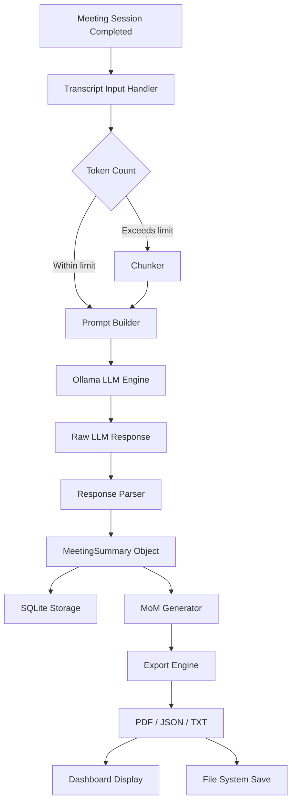
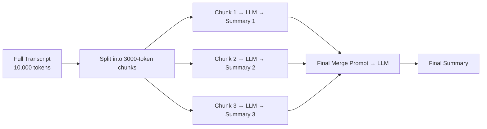

# 07 — Meeting Summarization & Minutes of Meeting Generation

---

## Purpose

Define the architecture for the Meeting Summarization module — responsible for taking raw meeting transcripts and generating structured summaries, action items, decisions, and formal Minutes of Meeting (MoM) documents using a local LLM (Llama via Ollama).

---

## Scope

| In Scope | Out of Scope |
|---|---|
| LLM-based transcript summarization | Real-time summarization during recording |
| Action item extraction | Calendar event creation |
| Decision point extraction | Email dispatch |
| MoM PDF generation | CRM integration |
| Custom summary templates | Voice playback of summary |
| Storage and retrieval of summaries | Summary translation |

---

## Architecture Overview

```
┌────────────────────────────────────────────────────────────────┐
│               MEETING SUMMARIZATION MODULE                     │
│                                                                │
│  ┌───────────┐   ┌──────────────┐   ┌──────────────────────┐  │
│  │Transcript │──▶│  Prompt      │──▶│   Ollama LLM         │  │
│  │  Input    │   │  Builder     │   │   (Llama 3.1)        │  │
│  └───────────┘   └──────────────┘   └──────────────────────┘  │
│                                                │               │
│                                    ┌───────────▼────────────┐  │
│                                    │  Response Parser       │  │
│                                    │  Summary / Actions /   │  │
│                                    │  Decisions / MoM       │  │
│                                    └───────────┬────────────┘  │
│                                                │               │
│                     ┌──────────────────────────▼────────────┐  │
│                     │  Export Engine (PDF / JSON / TXT)     │  │
│                     └───────────────────────────────────────┘  │
└────────────────────────────────────────────────────────────────┘
```

---

## Component Descriptions

### 1. Transcript Input Handler

Receives transcript from:
- Meeting Transcription module (session_id lookup)
- Direct text input (paste or upload)

Performs pre-processing:
- Token count estimation
- Chunking if transcript exceeds LLM context window
- Metadata injection (date, participants, title)

```python
class TranscriptInputHandler:
    MAX_TOKENS = 4096  # Llama 3.1 8B context

    def prepare(self, session_id: str) -> List[str]:
        transcript = db.get_transcript(session_id)
        chunks = self.chunk_by_tokens(transcript, max_tokens=3000)
        return chunks
```

---

### 2. Prompt Builder

Constructs structured prompts for each summarization task.

**Summary Prompt Template:**

```
You are an expert meeting analyst.
Given the following meeting transcript, generate:

1. SUMMARY: 3-5 sentence overview of the meeting.
2. KEY POINTS: Bullet list of main topics discussed.
3. ACTION ITEMS: List with owner and deadline if mentioned.
4. DECISIONS MADE: List of decisions reached.
5. OPEN QUESTIONS: Unresolved items requiring follow-up.

Transcript:
{transcript_text}

Respond in structured JSON format only.
```

**MoM Prompt Template:**

```
You are a professional secretary.
Generate formal Minutes of Meeting based on the following transcript.
Include: Date, Attendees, Agenda, Discussion Points, Decisions, Action Items, Next Meeting.
Use formal language.

Transcript:
{transcript_text}
```

---

### 3. Ollama LLM Engine

Calls local Llama model via Ollama REST API.

```python
import requests

class OllamaEngine:
    BASE_URL = "http://localhost:11434"

    def generate(self, prompt: str, model: str = "llama3.1:8b") -> str:
        response = requests.post(
            f"{self.BASE_URL}/api/generate",
            json={
                "model": model,
                "prompt": prompt,
                "stream": False,
                "options": {
                    "temperature": 0.3,
                    "top_p": 0.9,
                    "num_predict": 1024
                }
            }
        )
        return response.json()["response"]
```

**Model Options:**

| Model | Use Case | VRAM |
|---|---|---|
| llama3.1:8b | Standard summarization | 8GB |
| llama3.1:70b | High quality MoM | 40GB+ |
| mistral:7b | Fast, lightweight option | 6GB |
| phi3:mini | Low resource fallback | 4GB |

---

### 4. Response Parser

Parses LLM JSON output into typed Python objects.

```python
from pydantic import BaseModel
from typing import List, Optional

class ActionItem(BaseModel):
    task: str
    owner: Optional[str]
    deadline: Optional[str]
    priority: str = "medium"

class MeetingSummary(BaseModel):
    session_id: str
    summary: str
    key_points: List[str]
    action_items: List[ActionItem]
    decisions: List[str]
    open_questions: List[str]
    generated_at: datetime
```

---

### 5. MoM Generator

Produces formal Minutes of Meeting document.

**MoM Structure:**

```
MINUTES OF MEETING
==================
Meeting Title   : Q3 Planning Review
Date & Time     : September 1, 2024 | 14:30 IST
Location        : [Virtual / Room Name]
Prepared By     : AI Assistant Robot
Attendees       : Alice (Chair), Bob, Carol

AGENDA
------
1. Q3 Performance Review
2. Budget Planning
3. Resource Allocation

DISCUSSION SUMMARY
------------------
[Detailed summary per agenda item]

DECISIONS MADE
--------------
1. Budget increased by 15% for Q4
2. Hiring freeze lifted for engineering team

ACTION ITEMS
------------
| # | Task                | Owner | Deadline   | Status  |
|---|---------------------|-------|------------|---------|
| 1 | Submit Q3 report    | Alice | 2024-09-05 | Pending |
| 2 | Draft hiring plan   | Bob   | 2024-09-10 | Pending |

OPEN QUESTIONS
--------------
1. Final approval on vendor selection pending CFO review.

NEXT MEETING
------------
Date: September 15, 2024
```

---

### 6. Export Engine

Generates formatted MoM in multiple formats.

```python
class MoMExporter:
    def to_pdf(self, summary: MeetingSummary) -> bytes:
        # Uses reportlab
        ...

    def to_json(self, summary: MeetingSummary) -> dict:
        return summary.dict()

    def to_txt(self, summary: MeetingSummary) -> str:
        ...

    def to_markdown(self, summary: MeetingSummary) -> str:
        ...
```

---

## Data Flow



---

## Chunking Strategy for Long Transcripts



---

## Database Schema

```sql
CREATE TABLE meeting_summaries (
    id INTEGER PRIMARY KEY AUTOINCREMENT,
    session_id TEXT UNIQUE NOT NULL,
    summary TEXT,
    key_points TEXT,        -- JSON array
    decisions TEXT,         -- JSON array
    open_questions TEXT,    -- JSON array
    model_used TEXT,
    prompt_tokens INTEGER,
    completion_tokens INTEGER,
    processing_time_sec REAL,
    created_at DATETIME DEFAULT CURRENT_TIMESTAMP,
    FOREIGN KEY (session_id) REFERENCES meeting_sessions(session_id)
);

CREATE TABLE action_items (
    id INTEGER PRIMARY KEY AUTOINCREMENT,
    session_id TEXT NOT NULL,
    task TEXT NOT NULL,
    owner TEXT,
    deadline TEXT,
    priority TEXT DEFAULT 'medium',
    status TEXT DEFAULT 'pending',
    created_at DATETIME DEFAULT CURRENT_TIMESTAMP,
    updated_at DATETIME DEFAULT CURRENT_TIMESTAMP,
    FOREIGN KEY (session_id) REFERENCES meeting_sessions(session_id)
);

CREATE TABLE mom_documents (
    id INTEGER PRIMARY KEY AUTOINCREMENT,
    session_id TEXT NOT NULL,
    content_markdown TEXT,
    content_pdf_path TEXT,
    generated_at DATETIME DEFAULT CURRENT_TIMESTAMP,
    FOREIGN KEY (session_id) REFERENCES meeting_sessions(session_id)
);
```

---

## API Design

```
POST  /api/v1/summarize/{session_id}
GET   /api/v1/summarize/{session_id}/result
POST  /api/v1/summarize/{session_id}/mom
GET   /api/v1/summarize/{session_id}/mom/export?format=pdf
GET   /api/v1/summarize/{session_id}/action-items
PATCH /api/v1/summarize/{session_id}/action-items/{item_id}
GET   /api/v1/summarize/list
```

---

## Design Decisions

| Decision | Choice | Reason |
|---|---|---|
| LLM | Llama 3.1 via Ollama | Local, no API cost, privacy |
| Temperature | 0.3 | Factual, consistent output |
| Output format | JSON | Easy parsing, structured |
| Long transcript | Chunk + merge | Fits within context window |
| MoM format | Markdown → PDF | Easy to style and export |
| Action item storage | Separate table | Easy to query and update |

---

## Future Scalability

- Add status tracking per action item (pending / in-progress / done)
- Email dispatch of MoM via SMTP integration
- Calendar event creation from action items
- Support for multiple LLM models (user selectable)
- Topic segmentation — identify agenda items automatically
- Sentiment analysis per meeting segment

---

## Implementation Notes

1. Always validate LLM JSON output before parsing — use `try/except` with fallback
2. Log all prompt + response pairs for debugging and quality review
3. Temperature 0.3 gives consistent structured output — avoid higher values for summaries
4. For chunked transcripts, always include meeting metadata in every chunk prompt
5. PDF generation should be triggered as background task — do not block API response
6. Store both raw LLM response and parsed structured summary in DB