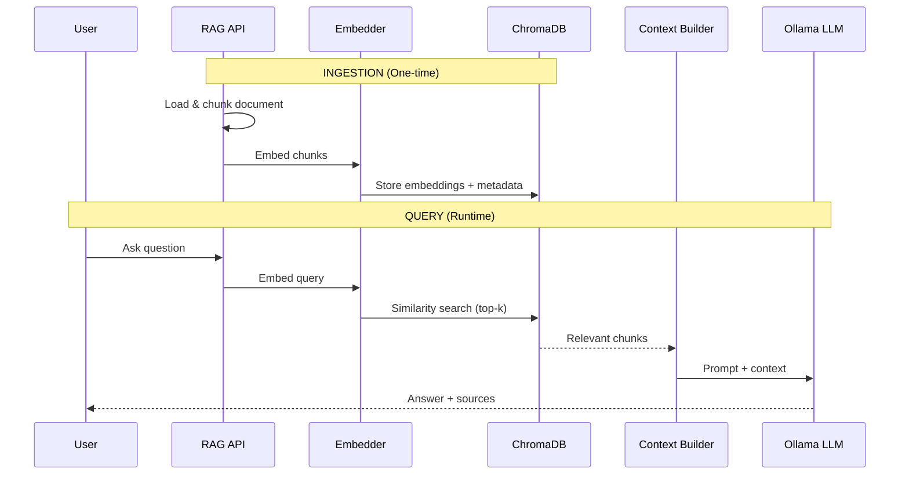

# 08 — Knowledge AI (RAG System)

---

## Purpose

Define the architecture for the Retrieval-Augmented Generation (RAG) module — enabling the AI robot to answer questions from a user-provided knowledge base (documents, PDFs, notes) using vector similarity search combined with a local LLM for context-aware responses.

---

## Scope

| In Scope | Out of Scope |
|---|---|
| Document ingestion pipeline | Web scraping / crawling |
| Vector embedding generation | External API knowledge sources |
| Semantic similarity search | Real-time knowledge updates |
| LLM-augmented answer generation | Training / fine-tuning models |
| Multi-document knowledge base | Multi-user knowledge bases |
| Source citation in responses | Graph-based knowledge retrieval |

---

## Architecture Overview

```
┌─────────────────────────────────────────────────────────────────────┐
│                        RAG MODULE                                   │
│                                                                     │
│  INGESTION PATH                  QUERY PATH                         │
│  ──────────────                  ──────────                         │
│  ┌──────────┐                   ┌──────────┐                        │
│  │ Document │                   │  User    │                        │
│  │ Loader   │                   │  Query   │                        │
│  └────┬─────┘                   └────┬─────┘                        │
│       │                              │                              │
│  ┌────▼─────┐                  ┌─────▼──────┐                       │
│  │  Chunker │                  │  Embedder  │                       │
│  └────┬─────┘                  └─────┬──────┘                       │
│       │                              │                              │
│  ┌────▼─────┐                  ┌─────▼──────┐                       │
│  │ Embedder │                  │  ChromaDB  │                       │
│  └────┬─────┘                  │  Search    │                       │
│       │                        └─────┬──────┘                       │
│  ┌────▼─────┐                        │                              │
│  │ ChromaDB │                  ┌─────▼──────┐                       │
│  │  Store   │                  │  Context   │                       │
│  └──────────┘                  │  Builder   │                       │
│                                └─────┬──────┘                       │
│                                      │                              │
│                                ┌─────▼──────┐                       │
│                                │  Ollama    │                       │
│                                │  LLM       │                       │
│                                └─────┬──────┘                       │
│                                      │                              │
│                                ┌─────▼──────┐                       │
│                                │  Response  │                       │
│                                │  + Sources │                       │
│                                └────────────┘                       │
└─────────────────────────────────────────────────────────────────────┘
```

---

## Component Descriptions

### 1. Document Loader

Supports multiple file formats for knowledge ingestion.

| Format | Library |
|---|---|
| PDF | `PyMuPDF` / `pdfplumber` |
| DOCX | `python-docx` |
| TXT | built-in |
| Markdown | built-in |
| CSV | `pandas` |
| Web URL | `requests` + `BeautifulSoup` |

```python
class DocumentLoader:
    def load(self, source: str) -> List[Document]:
        ext = Path(source).suffix.lower()
        loaders = {
            ".pdf": self._load_pdf,
            ".docx": self._load_docx,
            ".txt": self._load_txt,
            ".md": self._load_markdown,
        }
        return loaders[ext](source)
```

---

### 2. Text Chunker

Splits documents into semantically meaningful chunks for embedding.

**Chunking Strategy:**

```python
from langchain.text_splitter import RecursiveCharacterTextSplitter

splitter = RecursiveCharacterTextSplitter(
    chunk_size=512,
    chunk_overlap=64,
    separators=["\n\n", "\n", ". ", " ", ""]
)
```

**Chunk Metadata:**

```python
{
  "chunk_id": "doc_001_chunk_004",
  "document_id": "doc_001",
  "document_name": "engineering_manual.pdf",
  "page_number": 3,
  "chunk_index": 4,
  "text": "The turbine operates at...",
  "char_count": 487
}
```

---

### 3. Embedding Engine

Converts text chunks into dense vector representations.

**Embedding Model Options:**

| Model | Dimensions | Speed | Quality |
|---|---|---|---|
| `nomic-embed-text` (Ollama) | 768 | Fast | Good |
| `all-MiniLM-L6-v2` (sentence-transformers) | 384 | Fast | Good |
| `all-mpnet-base-v2` | 768 | Medium | Very Good |
| `text-embedding-3-small` (OpenAI, optional) | 1536 | Fast | Best |

> **Default:** `nomic-embed-text` via Ollama (fully local, no API key)

```python
from langchain_community.embeddings import OllamaEmbeddings

embeddings = OllamaEmbeddings(model="nomic-embed-text")
vector = embeddings.embed_query("What is heat transfer?")
```

---

### 4. ChromaDB Vector Store

Persistent vector database for storing and querying embeddings.

```python
import chromadb
from chromadb.config import Settings

client = chromadb.PersistentClient(
    path="./data/chromadb",
    settings=Settings(anonymized_telemetry=False)
)

collection = client.get_or_create_collection(
    name="knowledge_base",
    metadata={"hnsw:space": "cosine"}
)
```

**Storage:**

```
data/
└── chromadb/
    ├── chroma.sqlite3
    └── <collection_uuid>/
        ├── data_level0.bin
        └── header.bin
```

---

### 5. Retriever

Performs similarity search to find top-k relevant chunks.

```python
class Retriever:
    def retrieve(self, query: str, k: int = 5) -> List[Document]:
        query_embedding = self.embedder.embed_query(query)
        results = self.collection.query(
            query_embeddings=[query_embedding],
            n_results=k,
            include=["documents", "metadatas", "distances"]
        )
        return self._format_results(results)
```

**Retrieval Parameters:**

| Parameter | Value | Notes |
|---|---|---|
| Top-k | 5 | Number of chunks to retrieve |
| Distance metric | Cosine | Semantic similarity |
| Min similarity score | 0.3 | Filter irrelevant results |
| Reranking | Optional | Cross-encoder reranker |

---

### 6. Context Builder

Assembles retrieved chunks into a coherent context block for the LLM.

```python
def build_context(self, chunks: List[Document], query: str) -> str:
    context_parts = []
    for i, chunk in enumerate(chunks):
        context_parts.append(
            f"[Source {i+1}: {chunk.metadata['document_name']}]\n{chunk.text}"
        )
    return "\n\n---\n\n".join(context_parts)
```

---

### 7. RAG Chain

Orchestrates the full query pipeline using LangChain.

```python
from langchain.chains import RetrievalQA
from langchain_community.llms import Ollama

llm = Ollama(model="llama3.1:8b", temperature=0.2)

rag_chain = RetrievalQA.from_chain_type(
    llm=llm,
    chain_type="stuff",
    retriever=vectorstore.as_retriever(search_kwargs={"k": 5}),
    return_source_documents=True
)

result = rag_chain.invoke({"query": "What is the valve pressure rating?"})
```

**RAG Prompt Template:**

```
You are a helpful assistant with access to a knowledge base.
Answer the user's question using ONLY the context provided below.
If the answer is not in the context, say "I don't have information on that in my knowledge base."
Always cite the source document.

Context:
{context}

Question:
{question}

Answer:
```

---

## Data Flow



---

## Database Schema

```sql
CREATE TABLE knowledge_documents (
    id INTEGER PRIMARY KEY AUTOINCREMENT,
    document_id TEXT UNIQUE NOT NULL,
    filename TEXT NOT NULL,
    file_path TEXT,
    file_type TEXT,
    file_size_bytes INTEGER,
    total_chunks INTEGER,
    total_tokens INTEGER,
    status TEXT DEFAULT 'pending',  -- pending | indexed | failed
    collection_name TEXT DEFAULT 'knowledge_base',
    indexed_at DATETIME,
    created_at DATETIME DEFAULT CURRENT_TIMESTAMP
);

CREATE TABLE knowledge_queries (
    id INTEGER PRIMARY KEY AUTOINCREMENT,
    query_id TEXT UNIQUE NOT NULL,
    query_text TEXT NOT NULL,
    response_text TEXT,
    source_documents TEXT,    -- JSON array of source names
    similarity_scores TEXT,   -- JSON array
    model_used TEXT,
    processing_time_sec REAL,
    created_at DATETIME DEFAULT CURRENT_TIMESTAMP
);
```

---

## API Design

```
POST  /api/v1/rag/ingest              # Upload and index document
GET   /api/v1/rag/documents           # List indexed documents
DELETE /api/v1/rag/documents/{doc_id} # Remove document
POST  /api/v1/rag/query               # Ask a question
GET   /api/v1/rag/query/{query_id}    # Get past query result
GET   /api/v1/rag/status              # Collection stats
POST  /api/v1/rag/reset               # Clear entire knowledge base
```

### Query Request

```json
POST /api/v1/rag/query
{
  "query": "What is the maximum operating pressure of valve V-301?",
  "top_k": 5,
  "collection": "knowledge_base"
}
```

### Query Response

```json
{
  "query_id": "qry_20240901_001",
  "answer": "Valve V-301 has a maximum operating pressure of 150 PSI...",
  "sources": [
    {
      "document": "P&ID_Manual_Rev3.pdf",
      "page": 12,
      "similarity_score": 0.91,
      "excerpt": "V-301 rated at 150 PSI @ 200°C..."
    }
  ],
  "processing_time_sec": 1.8
}
```

---

## Directory Structure

```
services/rag/
├── main.py                # FastAPI app
├── document_loader.py     # Multi-format loader
├── chunker.py             # Text splitting
├── embedder.py            # Embedding engine
├── vector_store.py        # ChromaDB wrapper
├── retriever.py           # Similarity search
├── context_builder.py     # Prompt assembly
├── rag_chain.py           # LangChain orchestration
├── data/
│   ├── chromadb/          # Vector store
│   └── documents/         # Uploaded files
├── tests/
│   ├── test_ingest.py
│   ├── test_query.py
│   └── sample_docs/
└── requirements.txt
```

---

## Design Decisions

| Decision | Choice | Reason |
|---|---|---|
| Vector DB | ChromaDB | Local, persistent, Python-native |
| Embedding model | nomic-embed-text | Free, local, high quality |
| LLM | Llama 3.1 via Ollama | Local, private, no API cost |
| Chunk size | 512 tokens | Balance context and precision |
| Chunk overlap | 64 tokens | Preserve sentence continuity |
| Chain type | stuff | Sufficient for most queries |
| Distance metric | Cosine | Standard for NLP embeddings |

---

## Future Scalability

- Add hybrid search (keyword BM25 + semantic vector)
- Add cross-encoder reranker for higher precision
- Multi-collection support (per-project knowledge bases)
- Document update / re-indexing pipeline
- Conversation history context injection
- Support for structured data (CSV → table QA)
- Migrate to Qdrant or Weaviate for high-scale deployment

---

## Implementation Notes

1. Embed queries at query time — never cache query embeddings
2. Persist ChromaDB to disk — data survives container restarts
3. Validate chunk count before indexing — warn if document is too small
4. Show source citations in every RAG response for trust and verification
5. Handle empty retrieval gracefully — LLM should say "not found" not hallucinate
6. Run ingestion as a background task — large PDFs can take 30–60 seconds