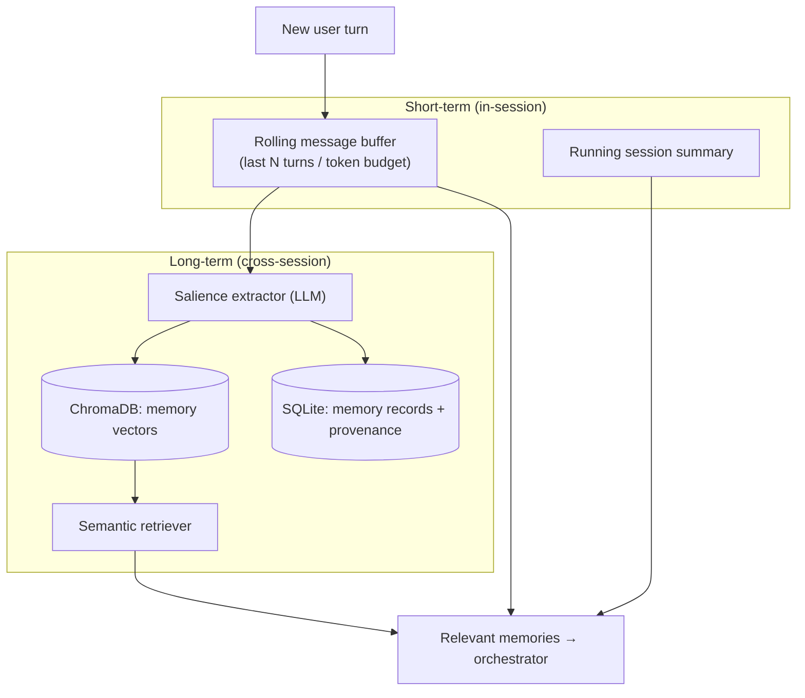
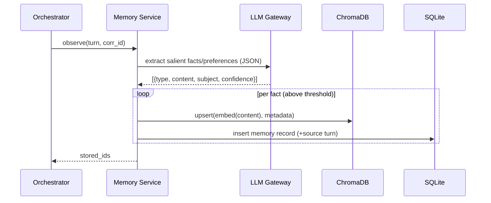
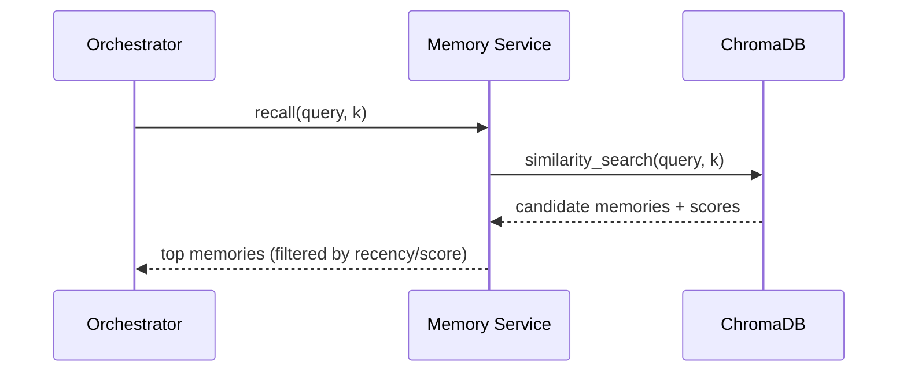

# 09 — Memory System

**Phase:** 7 — Long-Term Memory
**Purpose:** Specify how the assistant remembers — short-term conversational context within a session and durable long-term memory (facts, preferences, past interactions) across sessions — reusing the embedding + vector infrastructure from RAG (`08`).

---

## Purpose

Give the assistant continuity. Without memory it's a stateless chatbot; with it, it honors stated preferences, recalls earlier facts, and feels personal across days.

## Scope

In: short-term context buffer, long-term memory write/retrieve, salience/extraction policy, forgetting/redaction, semantic recall. Out: RAG over external documents (`08`), session transport (`14`). Implements FR-MEM-1…4.

> **Memory vs. RAG.** RAG answers from a *document corpus*. Memory stores *personal/interaction-derived* facts ("user prefers bullet summaries," "the Q3 launch is Aug 14"). They share embedding + vector tech but are separate collections with separate write paths.

---

## 1. Two-tier architecture



| Tier | Holds | Lifetime | Backed by |
|---|---|---|---|
| Short-term | Recent turns + running summary | Session | In-memory + SQLite session row |
| Long-term | Salient facts, preferences, entities | Persistent | ChromaDB (vectors) + SQLite (records) |

## 2. Write path (what gets remembered)



Not everything is stored — a salience policy (LLM extraction + confidence threshold + dedup) keeps memory clean. Facts carry **provenance** (which turn/session) for explainability and forgetting.

## 3. Read path (recall)



The orchestrator injects recalled memories + short-term summary into the LLM prompt alongside RAG context (`14 §pipeline`).

## 4. Interface (contract excerpt)

| Method | Path | Body | Returns |
|---|---|---|---|
| POST | `/v1/memory/observe` | `{ session_id, turn, corr_id }` | `{ stored_ids[] }` |
| POST | `/v1/memory/recall` | `{ query, k?, types? }` | `{ memories[] }` |
| GET | `/v1/memory` | `?subject=` | list memories |
| DELETE | `/v1/memory/{id}` | — | forget one |
| POST | `/v1/memory/forget` | `{ subject \| query }` | bulk forget |

## 5. Memory record shape

```json
{
  "id": "mem_42",
  "type": "preference|fact|entity|event",
  "content": "Prefers bullet-point summaries",
  "subject": "user",
  "confidence": 0.86,
  "source": {"session_id": "s_9", "turn_id": "t_3"},
  "created_at": "2026-06-08T10:00:00Z",
  "last_used_at": null
}
```

## Design decisions

- **Two tiers, not one** — cheap recency (buffer) for coherence + durable semantic recall for personalization; different mechanisms for different needs.
- **LLM-extracted salience** — store *meaning*, not raw transcripts; keeps the store small and high-signal.
- **Provenance + user-controllable forgetting** — FR-MEM-4 and privacy (`21`): users can inspect and delete memories; each memory knows where it came from.
- **Reuse RAG's vector stack** — one embedding model, one vector DB technology; separate collection/namespace.

## Technology choices

| Need | Choice | Alternatives |
|---|---|---|
| Vector store | ChromaDB (separate collection) | pgvector (Stage 2) |
| Extraction | LLM Gateway (Llama) | rule-based (brittle) |
| Records | SQLite | managed DB (Stage 2) |
| Embeddings | shared with RAG | — |

## Future scalability considerations

- **Memory decay / reinforcement** — boost frequently-used memories, age out stale ones.
- **Conflict resolution** — when a new fact contradicts an old one, supersede with history.
- **Per-user namespaces** for multi-user / fleet.
- **Episodic vs. semantic** separation (events timeline vs. distilled facts).
- **Privacy tiers** — mark memories non-syncable so they never leave the device.

## Implementation notes

- Run `observe` asynchronously off the response path so it never adds voice-loop latency.
- Deduplicate by semantic similarity before insert (don't store the same preference five times).
- Cap injected memories (top-k + token budget) to avoid prompt bloat and contradictory context.
- Default long-term memory to **local-only**; syncing memory is opt-in and namespaced (`13`, `21`).
