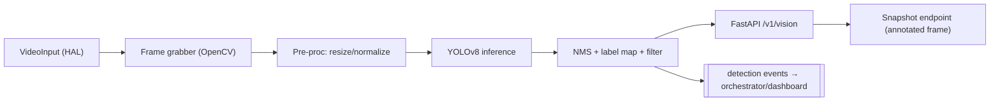
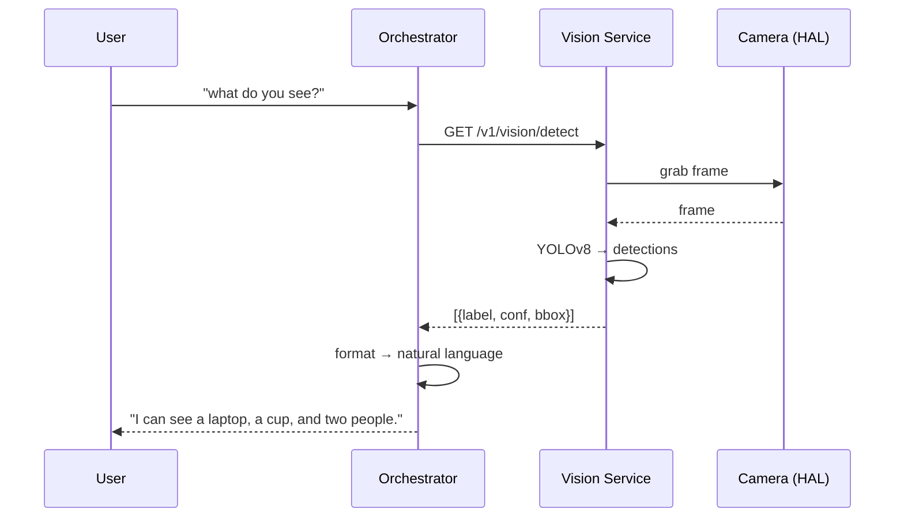

# 10 — Object Detection

**Phase:** 8 — Object Detection
**Purpose:** Specify the vision service: capture the camera feed (via HAL), run YOLOv8 object detection, and expose detections so the assistant can answer "what do you see?" and react to its environment.

---

## Purpose

Give the assistant sight — perception of objects in view — as a clean, edge-resident service independent of the text pipeline. This is parallelizable with the meeting/knowledge track (`02`).

## Scope

In: camera capture, YOLOv8 inference, detection output (labels, confidence, boxes), a snapshot/stream API, and an "interpretation" hook that turns detections into natural language via the orchestrator. Out: Face Recognition, Navigation/SLAM, Pick-and-Place (all out of scope). Implements FR-OD-1…3.

---

## 1. Architecture

| Component | Responsibility |
|---|---|
| Frame grabber | Pulls frames from the camera via HAL (OpenCV) |
| Pre-processing | Resize/letterbox + normalize to model input |
| YOLOv8 | Object detection inference |
| Post-processing | NMS, confidence filtering, label mapping |
| API | On-demand detect + annotated snapshot |
| Events | Push notable detections to orchestrator/dashboard |

## 2. Data flow

## 3. Interface (contract excerpt)

| Method | Path | Body/Params | Returns |
|---|---|---|---|
| GET | `/v1/vision/detect` | `?min_conf=0.4` | `{ detections:[{label,confidence,bbox}], ts }` |
| GET | `/v1/vision/snapshot` | `?annotated=true` | image (annotated) |
| WS | `/v1/vision/stream` | — | detection events stream |
| GET | `/v1/vision/classes` | — | model class list |
| GET | `/health` | — | `{status, model, device, fps}` |

`bbox` = `[x1,y1,x2,y2]` in pixels; include frame dimensions for normalization.

## 4. Model & performance

| Model | Use | Trade-off |
|---|---|---|
| YOLOv8n/s | Laptop / edge default | Fast, real-time on CPU/modest GPU |
| YOLOv8m/l | Higher accuracy (GPU/cloud) | Slower, better mAP |

Detection runs on demand for "what do you see?" and optionally as a throttled background stream (configurable FPS) to feed events without saturating compute.

## Design decisions

- **On-demand by default, stream optional** — continuous full-rate detection wastes power, especially on a battery-powered robot; throttle/trigger instead.
- **Edge-resident** — camera-local inference avoids shipping video frames over the network (bandwidth + privacy).
- **Detections, not raw video, leave the service** — the API returns structured detections + optional annotated snapshot, not the live stream.
- **Interpretation lives in the orchestrator** — vision returns facts; turning "person, laptop, cup" into a sentence is a language task.

## Technology choices

| Need | Choice | Alternatives |
|---|---|---|
| Detection | Ultralytics YOLOv8 | YOLO-NAS, Detectron2 — YOLOv8 per stack, great speed/accuracy |
| Capture/IO | OpenCV via HAL | GStreamer (Stage 2 robot cameras) |
| Runtime | PyTorch / ONNX | ONNX/TensorRT export for edge acceleration (Stage 2) |

## Future scalability considerations

- **ONNX/TensorRT export** for Jetson-class edge acceleration in Stage 2.
- **Scene description** combining detections with a vision-language model for richer answers.
- **Sound-Source Tracking fusion** (secondary feature) — point the camera/attention toward the speaker.
- **Custom-trained classes** for domain objects (e.g., specific equipment).
- **Tracking (not just detection)** to maintain object identity across frames.

## Implementation notes

- Load the model once at startup; expose readiness after warm-up.
- Use letterbox preprocessing to preserve aspect ratio (avoids accuracy loss).
- Make FPS, confidence, and class allow-list configurable; expose measured FPS as a health metric.
- For Stage 2, abstract the capture pipeline so a GStreamer/CSI camera replaces the OpenCV webcam grabber at the HAL with no inference-code change.
