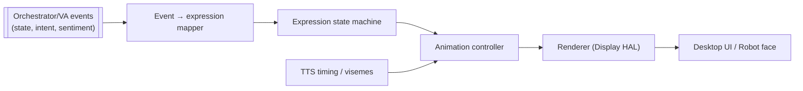
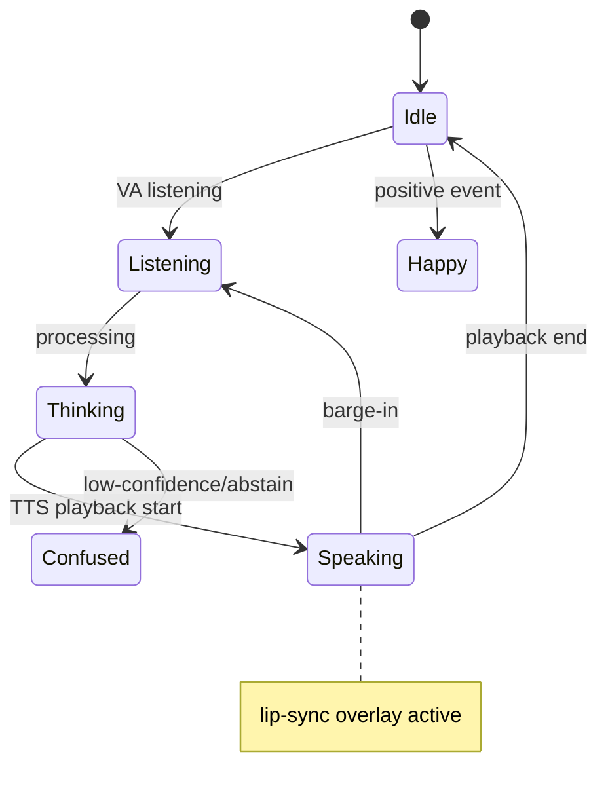
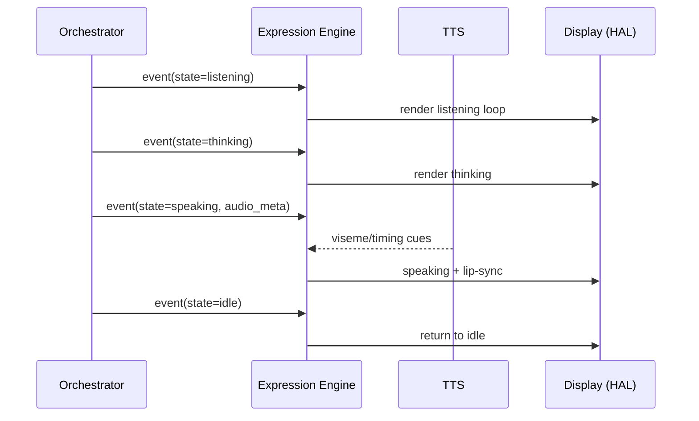

# 11 — Expression Engine (Entertainment Expressions)

**Phase:** 9 — Entertainment Expressions
**Purpose:** Specify the persona layer: an animated face/expression system that visibly reflects the assistant's state (idle, listening, thinking, speaking) and reacts to events, making interaction legible and engaging.

---

## Purpose

Make the assistant's internal state *visible and personable*. Humans trust and enjoy systems whose state they can read at a glance; the expression engine turns orchestrator events into animations.

## Scope

In: an expression state machine, an event→animation mapping, a renderer (desktop display in Stage 1; robot display in Stage 2 via HAL), and lip-sync/visemes synchronized with TTS. Out: TTS audio (`04`/TTS service), reasoning (`14`). Implements FR-EXP-1…2.

---

## 1. Architecture

| Component | Responsibility |
|---|---|
| Event mapper | Translates system events into target expressions |
| State machine | Manages current expression + transitions/blends |
| Animation controller | Drives frames/tweens; overlays lip-sync during speech |
| Renderer | Paints to the display via HAL (web canvas now, robot panel later) |

## 2. Expression states

| State | Trigger | Visual |
|---|---|---|
| Idle | no activity | gentle blink/breathe loop |
| Listening | wake word / VAD active | attentive, subtle pulse |
| Thinking | pipeline processing | "loading"/pondering motion |
| Speaking | TTS playback | mouth visemes synced to audio |
| Happy/Confused/etc. | sentiment/abstain events | brief reaction, returns to base |

## 3. Event → animation flow

## 4. Interface (contract excerpt)

| Method | Path | Body | Returns |
|---|---|---|---|
| POST | `/v1/expression/state` | `{ state, intensity?, ttl_ms? }` | `200` |
| POST | `/v1/expression/event` | `{ type, payload }` | `200` |
| WS | `/v1/expression/visemes` | viseme stream during speech | — |

Primarily **event-driven**: subscribes to orchestrator/VA state events rather than being polled.

## Design decisions

- **State-driven, not script-driven** — expressions derive from real system state, so the face is always honest about what the assistant is doing.
- **Renderer behind the Display HAL** — same engine drives a desktop canvas now and a robot's screen later; only the renderer binding changes.
- **Lip-sync from TTS timing** — visemes are derived from the synthesized audio so mouth movement matches speech without a separate model.
- **Reactions are transient overlays** — brief emotion events return to a base state, avoiding a brittle explosion of permanent states.

## Technology choices

| Need | Choice | Alternatives |
|---|---|---|
| Stage-1 renderer | Web canvas / SVG / Lottie in a lightweight view | pygame |
| Lip-sync | Viseme mapping from TTS phoneme/timing | Rhubarb lip-sync |
| Transport | WebSocket events | SSE |
| Stage-2 renderer | Embedded display (LCD/OLED) via HAL | LED matrix for minimal hardware |

## Future scalability considerations

- **Richer affect** driven by sentiment of the conversation.
- **Gaze/attention** toward detected speaker (fuse with vision `10` + sound tracking).
- **Personality themes** (different faces/voices) selectable per deployment.
- **Hardware expressions** — servo eyebrows/ears or LED arrays on the robot, same event contract.

## Implementation notes

- Keep the engine stateless w.r.t. *content* — it reacts to events; it doesn't know what the assistant is saying.
- Decouple animation frame rate from event rate; interpolate between states for smooth transitions.
- Provide a deterministic "test mode" that cycles all states for QA on any display.
- Ensure graceful fallback: if the display is absent, the engine no-ops without affecting the voice loop.
