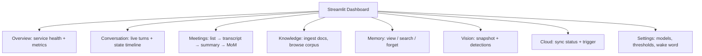
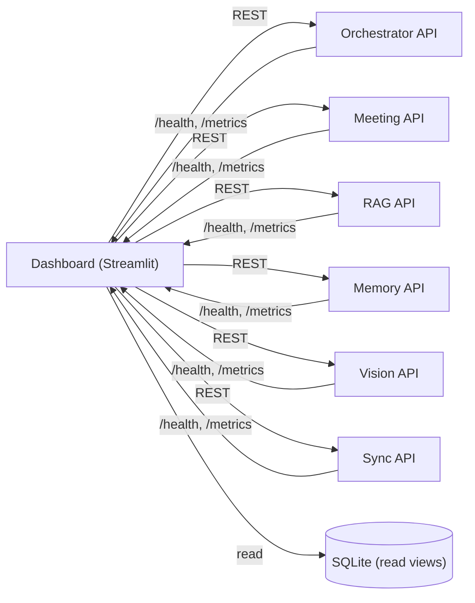
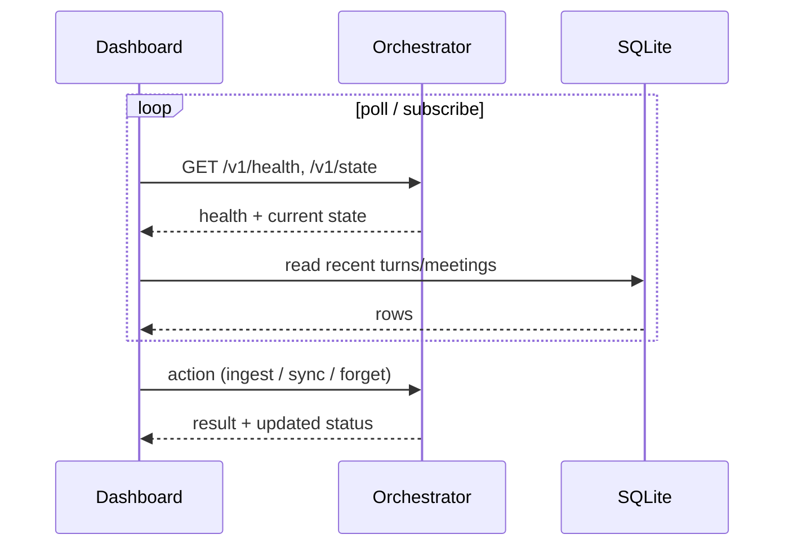

# 12 — Dashboard Design

**Phase:** 10 — Dashboard
**Purpose:** Specify the operator-facing monitoring and control surface (Streamlit): service health, live conversation/transcripts, memory inspection, document ingestion, vision feed, and cloud-sync control.

---

## Purpose

Give the operator (you/admin) a single pane of glass to observe and control the running assistant. It's how a black-box system becomes debuggable and demonstrable.

## Scope

In: health/metrics views, live conversation + meeting transcript views, RAG document ingestion + memory management, vision snapshot, sync trigger/status, configuration. Out: end-user voice interaction (that's the robot/voice front end). Implements FR-DASH-1…4.

---

## 1. Information architecture

## 2. How it connects

The dashboard is a **client of the service APIs** (`16`) plus read-only DB views — it holds no business logic, so it can run anywhere (operator laptop in Stage 1, remote console in Stage 2).

## 3. Page responsibilities

| Page | Shows / does | Backed by |
|---|---|---|
| Overview | Per-service health, latency, error rate, resource use | `/health`, `/metrics` |
| Conversation | Live turns, STT text, response, state timeline | orchestrator events + SQLite |
| Meetings | Browse meetings, view transcript, summary, download MoM | Meeting API |
| Knowledge | Upload/ingest docs, list corpus, delete | RAG API |
| Memory | Search/list memories, inspect provenance, forget | Memory API |
| Vision | Live/annotated snapshot, current detections | Vision API |
| Cloud | Last sync, pending items, trigger sync/restore | Sync API |
| Settings | Model sizes, thresholds, wake word, retention | Config |

## 4. Live update flow

## Design decisions

- **Streamlit for speed** — the fastest path to a functional control panel in Python; no separate frontend stack needed in Stage 1.
- **Thin client** — talks only to APIs + read views; no duplicated logic, so it stays correct as services evolve.
- **Operator tool, not the product UI** — the *product* surface is voice + expressions; the dashboard is for building, monitoring, and demoing.
- **Read/write split** — reads can hit DB views for snappiness; writes go through service APIs to respect invariants.

## Technology choices

| Need | Choice | Alternatives |
|---|---|---|
| UI framework | Streamlit | Gradio (ML-demo-ish), full React (heavier) |
| Charts | Streamlit/Plotly | — |
| Transport | REST + polling; WS where live | SSE |

## Future scalability considerations

- **Multi-unit fleet view** in Stage 2 (select a robot, see its health/conversations).
- **Auth + roles** for remote operation over the internet.
- **Alerting** on health/eval regressions.
- **Migrate to a production web app** (React + the same APIs) if it outgrows Streamlit — the API-client design makes this a drop-in.

## Implementation notes

- Cache health/metrics polls (short TTL) to avoid hammering services on every rerun (Streamlit reruns top-to-bottom).
- Keep heavy actions (ingest, sync) async with visible job status — never block the UI thread.
- Use the same `correlation_id` to link a dashboard conversation entry to its trace (`19`).
- Gate destructive actions (forget memory, delete doc, restore) behind a confirm step.
