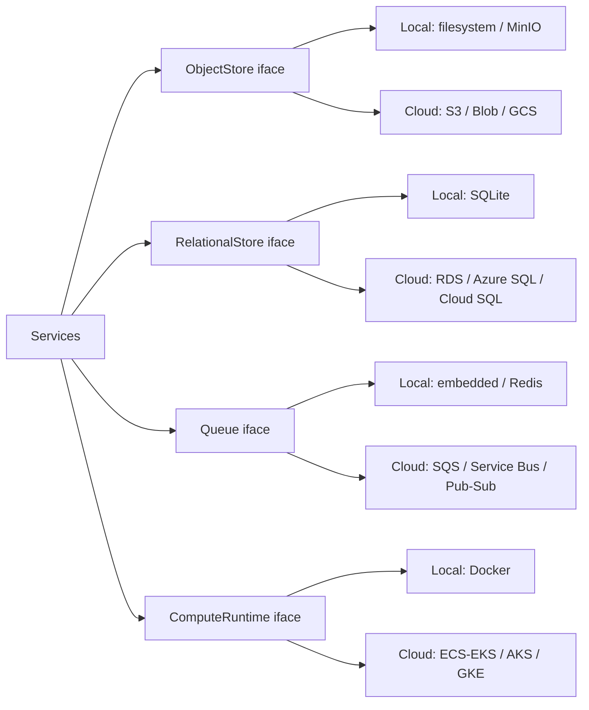

# 13 — Cloud Integration

**Phase:** 11 — Cloud Integration
**Purpose:** Specify cloud synchronization, backup, and remote monitoring in a **cloud-agnostic** way — with AWS as a reference architecture and a portability mapping to Azure/GCP/on-prem.

---

## Purpose

Add optional cloud capabilities — back up artifacts, sync across devices, and enable remote monitoring of a deployed robot — without ever making the cloud a hard dependency for Stage-1 core flows, and without locking the project to one provider.

## Scope

In: the Sync service, storage/queue/compute abstractions, what syncs and when, the AWS reference mapping, and the portability table. Out: provider-specific IaC scripts (Stage 2 deliverable), Stage-1 offline operation (already guaranteed). Implements FR-CLOUD-1…3; upholds NFR-PORT-1, NFR-PRIV-1.

---

## 1. Cloud-agnostic principle

Every cloud touchpoint is one of four **capabilities**, each behind an interface in `libs/storage` / `libs/contracts`:



Switching providers = swapping the implementation + config, never the service code (AD-6).

## 2. Portability mapping

| Capability | Local (Stage 1) | AWS (reference) | Azure | GCP |
|---|---|---|---|---|
| Object storage | Filesystem / MinIO | S3 | Blob Storage | Cloud Storage |
| Relational DB | SQLite | RDS (Postgres) | Azure DB for Postgres | Cloud SQL |
| Vector DB | ChromaDB | Chroma on EC2 / OpenSearch | AI Search / Chroma on VM | Vertex / Chroma on VM |
| Queue / events | Embedded / Redis | SQS / EventBridge | Service Bus | Pub/Sub |
| Container runtime | Docker Compose | ECS / EKS | AKS | GKE |
| Secrets | `.env` | Secrets Manager | Key Vault | Secret Manager |
| Monitoring | Local logs/metrics | CloudWatch | Monitor | Cloud Monitoring |

## 3. Sync architecture

```mermaid
flowchart TB
    subgraph local["Device (laptop / robot)"]
        prod["Services produce artifacts"] --> spool["Sync spool / outbox"]
        spool --> sync["Sync Service"]
        cache[("local DB snapshot")] --> sync
    end
    subgraph cloud["Cloud (reference: AWS)"]
        s3[("Object storage")]
        rds[("Managed DB")]
        mon["Monitoring"]
    end
    sync -->|push (opt-in)| s3
    sync -->|push metadata| rds
    sync -->|heartbeat/metrics| mon
    s3 -. restore .-> sync
```

## 4. What syncs, when

| Artifact | Direction | Trigger | Notes |
|---|---|---|---|
| Meeting audio + MoM PDF | up | on completion / scheduled | opt-in; large objects → object store |
| Transcripts/summaries metadata | up | on completion | small rows → managed DB |
| SQLite snapshot | up | scheduled | backup/restore |
| RAG corpus (optional) | up/down | manual | for fleet sharing |
| Long-term memory | up (opt-in, namespaced) | manual | default local-only (privacy) |
| Health/metrics heartbeat | up | periodic | remote monitoring |

## 5. Interface (contract excerpt)

| Method | Path | Body | Returns |
|---|---|---|---|
| POST | `/v1/sync/push` | `{ scope?: ["meetings","db","corpus"] }` | `{ job_id }` |
| POST | `/v1/sync/restore` | `{ snapshot_id }` | `{ job_id }` |
| GET | `/v1/sync/status` | — | last sync, pending, errors |

## Design decisions

- **Opt-in, additive cloud** — core features never require connectivity (NFR-PRIV-1, NFR-AVAIL-1). Sync enhances; it doesn't gate.
- **Capability abstractions, not provider SDKs in services** — services depend on interfaces; only the `libs/storage` implementations know about S3/Blob/GCS (AD-6, NFR-PORT-1).
- **Outbox/spool pattern** — artifacts queue locally and sync when connectivity allows; resilient to intermittent links (critical for a roaming robot).
- **Memory is local-by-default** — most privacy-sensitive data stays on device unless explicitly synced and namespaced.

## Technology choices

| Need | Choice (reference) | Why |
|---|---|---|
| Object storage | S3 / MinIO (S3-compatible) | One API spanning local + every cloud |
| Managed DB | Postgres (RDS) | SQLite→Postgres is a low-friction upgrade |
| Queue | SQS / Redis | Decoupled, reliable delivery |
| Orchestration | ECS/EKS (reference) | Stage-2 container runtime |

> S3-compatible (MinIO locally, S3 in cloud) means the *same* object-store code runs in both stages — the cleanest portability lever in the system.

## Future scalability considerations

- **Multi-region** object storage + DB read replicas for a global fleet.
- **Event-driven cloud pipelines** (e.g., new meeting → cloud summarization with a large model).
- **Conflict-free sync** for offline-edited data (CRDT/versioned records).
- **Per-tenant isolation** for productization.

## Implementation notes

- Encrypt artifacts in transit (TLS) and at rest (provider-managed keys).
- Make sync idempotent and resumable (content-hash keys, multipart for large objects).
- Keep all bucket/queue/db names + endpoints in config; the same image runs against MinIO or S3 by env var only.
- Surface sync status + failures in the dashboard (`12`); never fail a core flow because sync failed.
