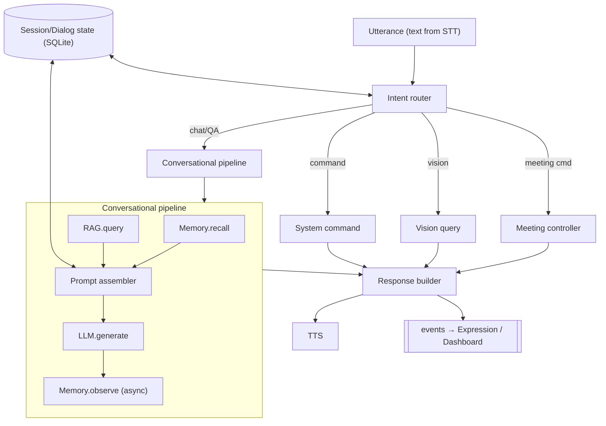
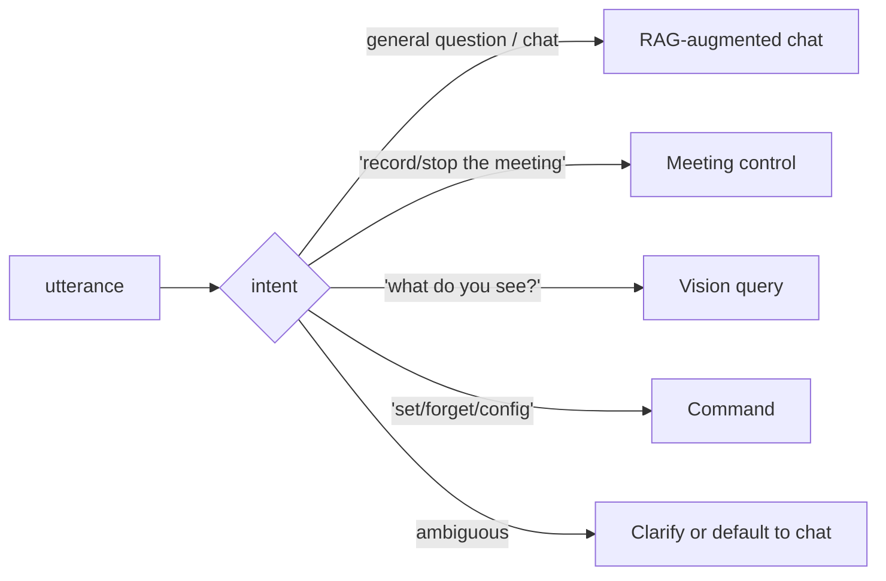
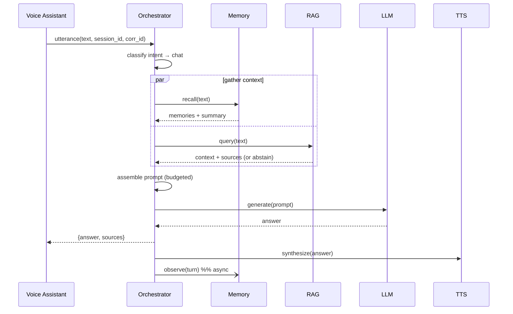
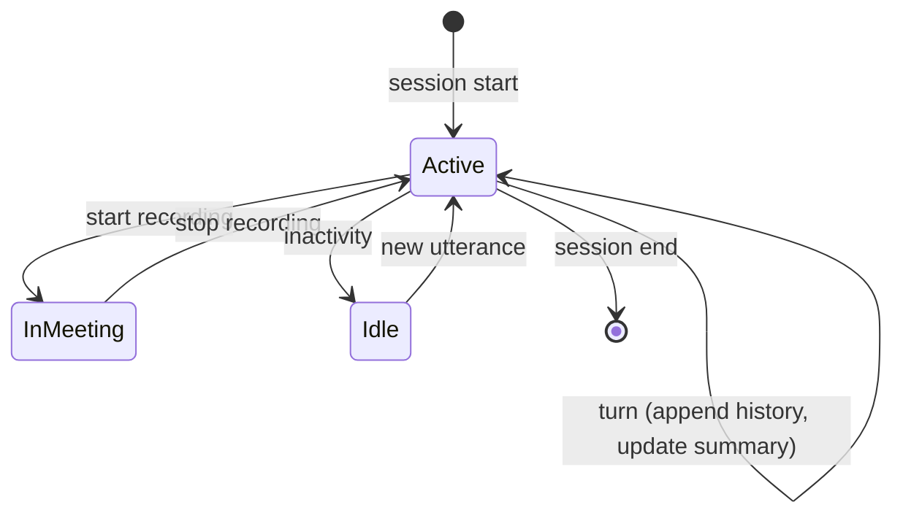

# 14 — Orchestrator Architecture

**Phase:** 12 — System Orchestrator
**Purpose:** Specify the central coordinator that turns independent services into one coherent assistant: intent routing, the conversational pipeline (memory + RAG + LLM + TTS), dialog/session state, and graceful degradation.

---

## Purpose

The orchestrator is the brain-stem. It receives an utterance from the voice front end and decides what happens: which services to call, in what order, how to assemble the prompt, and how to respond. Built **late** (Phase 12) so it integrates already-working services rather than guessing their shapes (AD-1, `02`).

## Scope

In: intent classification/routing, the response pipeline, prompt assembly, session/dialog state, tool/skill dispatch, degradation policy, event emission (for expressions/dashboard). Out: the internals of each downstream service (`04`–`13`). Implements FR-ORC-1…4.

---

## 1. Architecture

| Component | Responsibility |
|---|---|
| Intent router | Classify utterance → chat / meeting / vision / command |
| Memory.recall | Fetch relevant long-term memories + session summary |
| RAG.query | Retrieve grounded context when the intent is informational |
| Prompt assembler | Compose system + memory + context + history + question within token budget |
| LLM.generate | Produce the answer (via LLM Gateway) |
| Memory.observe | Persist salient new facts (off the response path) |
| Response builder | Final text + sources + state events |
| Degradation policy | Decide fallback when a dependency is unavailable |

## 2. Intent routing

Routing is a lightweight classifier (rules + LLM fallback). New intents/skills are added here without touching downstream services (extension point).

## 3. Conversational pipeline (canonical)

Memory recall and RAG retrieval run **in parallel** to protect latency (NFR-LAT-1).

## 4. Dialog / session state

Session row holds: `session_id`, history window, running summary, active intent/mode, last `corr_id`. Persisted to SQLite so a restart doesn't lose context.

## 5. Prompt assembly (budgeted)

| Slot | Source | Priority |
|---|---|---|
| System / persona | config | always |
| Relevant memories | Memory.recall | high |
| Retrieved context + sources | RAG.query | high (if informational) |
| Recent history / summary | session state | medium |
| User question | utterance | always |

Assembler enforces a token budget, trimming lowest-priority slots first; grounding instructions ("answer only from provided context; cite sources; say you don't know otherwise") are non-negotiable.

## 6. Graceful degradation (FR-ORC-4)

| Dependency down | Behavior |
|---|---|
| RAG | Answer from model + memory; note grounding unavailable |
| Memory | Proceed without personalization |
| Vision | "I can't see right now"; continue conversation |
| TTS | Return text reply (dashboard) / retry |
| LLM | Apologize + degrade to canned/help response; surface health alert |

Every inter-service call has a timeout + retry; a slow service degrades rather than hanging the loop.

## 7. Interface (contract excerpt)

| Method | Path | Body | Returns |
|---|---|---|---|
| POST | `/v1/utterance` | `{ text \| audio_ref, session_id?, corr_id }` | `{ answer, sources[], intent, state }` |
| GET | `/v1/state` | `?session_id=` | current dialog state |
| GET | `/v1/health` | — | aggregate downstream health |
| WS | `/v1/events` | — | state/intent event stream |

## Design decisions

- **Thin orchestrator, smart services** — coordination logic only; the heavy lifting stays in specialized services (keeps it testable and replaceable).
- **Parallel context gathering** — memory + RAG concurrently to meet latency targets.
- **Grounding is enforced here** — the orchestrator owns the prompt contract, so faithfulness rules can't be bypassed by a chatty model.
- **Degradation by design** — a distributed brain must keep talking when a limb is down; explicit fallbacks per dependency.
- **Built last, integrates proven parts** — avoids a speculative god-service (AD-1).

## Technology choices

| Need | Choice | Alternatives |
|---|---|---|
| Service | FastAPI (async) | — |
| Intent routing | rules + small-LLM classifier | dedicated intent model |
| Orchestration logic | explicit code (optionally LangChain for chains) | full agent framework (overkill here) |
| State | SQLite session store | in-memory (loses on restart) |

## Future scalability considerations

- **Tiered inference / escalation** — route hard queries from a small edge model to a large cloud model based on confidence (`03 §6`, `18`).
- **Tool/skill plugins** — add capabilities (calendar, email, web) as routed intents.
- **Multi-turn planning / agents** for complex tasks.
- **Per-user concurrent sessions** with isolated state + memory namespaces.

## Implementation notes

- Thread `correlation_id` from VA through every downstream call for end-to-end tracing (`19`).
- Make the pipeline configurable (which stages run per intent) via config, not hard-coded branches.
- Stream the LLM answer to TTS where possible to shave perceived latency (start speaking before full generation completes).
- Keep prompt templates + routing rules versioned; both are behavior and must be tested.
