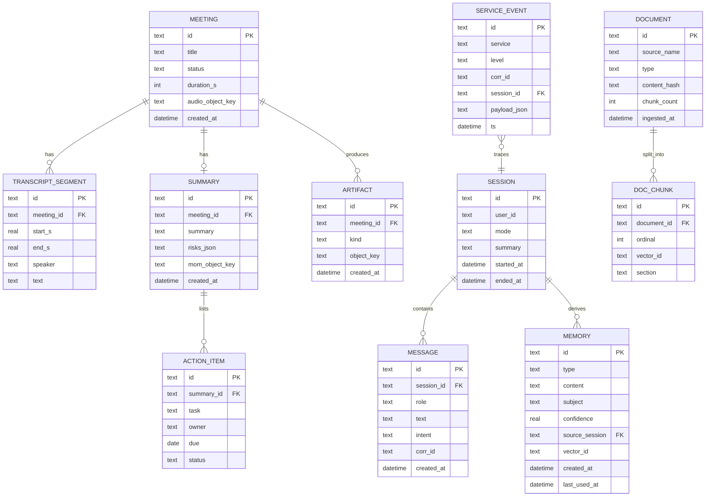

# 15 — Database Design

**Phase:** cross-cutting (established Phase 1, evolves through the build)
**Purpose:** Define the data model — the SQLite relational schema, the ChromaDB vector collections, and the object-store layout — plus the adapter strategy that makes Stage-2 migration (SQLite→Postgres, FS→S3) a config change.

---

## Purpose

A single, coherent data model shared across services. Defines tables, relationships, vector collections, and how raw artifacts are stored, with portability built in.

## Scope

In: relational schema (ER), vector collections + metadata, object-store layout, indexing, and the storage-adapter approach. Out: per-service query logic (in module docs). Realizes the data layer from `03 §7`; supports NFR-PORT-1.

---

## 1. Relational schema (SQLite → Postgres-compatible)



## 2. Table responsibilities

| Table | Owner service | Purpose |
|---|---|---|
| `session` / `message` | Orchestrator | Dialog state + conversation history |
| `memory` | Memory | Long-term memory records (vector in Chroma, metadata here) |
| `meeting` / `transcript_segment` | Meeting | Recording + transcript |
| `summary` / `action_item` | Meeting | Summary + extracted items |
| `document` / `doc_chunk` | RAG | Corpus registry (vectors in Chroma) |
| `artifact` | Meeting/Sync | Object-store references (audio, PDFs, snapshots) |
| `service_event` | All | Structured events/telemetry for dashboard + tracing |

## 3. Vector collections (ChromaDB)

| Collection | Vector of | Key metadata | Written by |
|---|---|---|---|
| `knowledge` | doc chunk text | `document_id, section, type, source_name, embedder_version` | RAG |
| `memory` | memory content | `memory_id, type, subject, confidence, created_at` | Memory |

Vectors store the embedding + a back-reference (`document_id`/`memory_id`) to the relational row — relational and vector stores are joined by these IDs (`vector_id` columns above).

## 4. Object-store layout

```text
artifacts/
  meetings/{meeting_id}/audio.wav
  meetings/{meeting_id}/mom.pdf
  vision/{ts}_snapshot.jpg
  backups/{date}/sqlite_snapshot.db
```

Same layout on local filesystem/MinIO (Stage 1) and cloud object storage (Stage 2) — S3-compatible keys throughout (`13`).

## 5. Indexing & integrity

| Concern | Approach |
|---|---|
| Lookups | Indexes on FKs, `session_id`, `meeting_id`, `corr_id`, `content_hash` |
| Dedup | `document.content_hash` unique; memory semantic-dedup before insert |
| Time queries | Indexes on `created_at`/`ts` |
| Referential integrity | FK constraints (enforced in Postgres; app-enforced in SQLite) |
| Vector↔row consistency | Delete cascades remove orphan vectors |

## Design decisions

- **SQLite now, Postgres-compatible schema** — types/constraints chosen so the same DDL migrates cleanly; adapters hide the difference (AD-3).
- **Metadata in relational, embeddings in vector** — each store does what it's best at; joined by stable IDs.
- **Object keys, not blobs, in the DB** — large binaries live in object storage; the DB holds references (keeps it light, syncs cheaply).
- **`embedder_version` in vector metadata** — detect and handle embedding-model upgrades without silent corruption.

## Technology choices

| Store | Stage 1 | Stage 2 | Adapter |
|---|---|---|---|
| Relational | SQLite | Postgres (RDS/Cloud SQL) | `libs/storage/relational` |
| Vector | ChromaDB | hosted/managed vector DB | `libs/storage/vector` |
| Object | FS / MinIO | S3-compatible | `libs/storage/object` |

## Future scalability considerations

- **pgvector** could unify relational + vector in Stage 2 (one DB to operate).
- **Partitioning/archival** of old meetings/events.
- **Per-user/tenant schemas or namespaces** for multi-user.
- **Read replicas** for the dashboard + fleet at scale.

## Implementation notes

- Use a migration tool (e.g., Alembic) from day one, even on SQLite, so schema evolution is versioned and replayable on Postgres.
- Keep a thin repository layer per table so services never write raw SQL inline.
- Back up = SQLite snapshot + Chroma persistence dir + object-store sync, captured together for a consistent restore (`13`).
- Store timestamps in UTC ISO-8601 everywhere.
