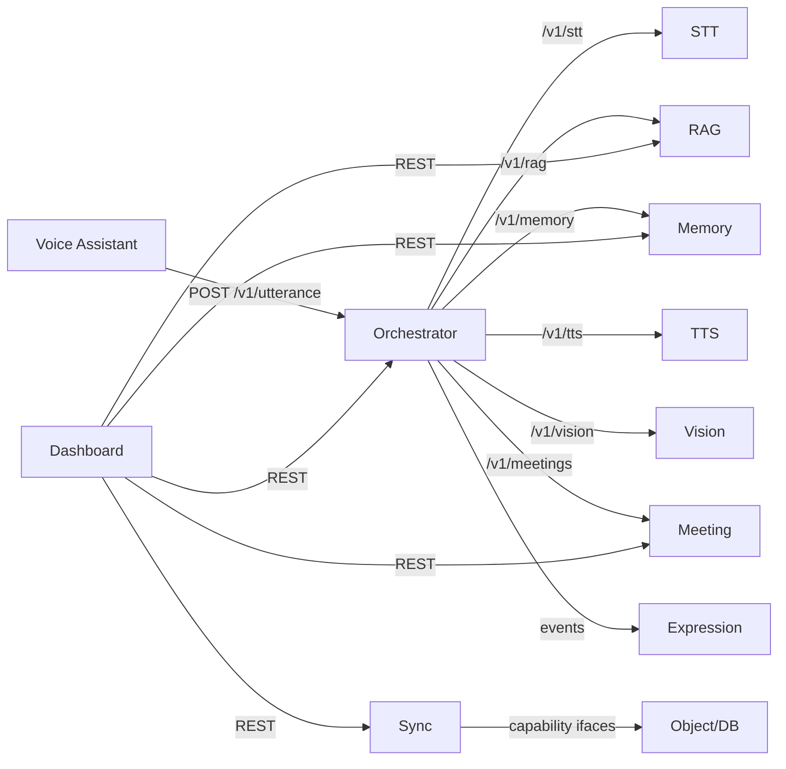

# 16 — API Design

**Phase:** cross-cutting (contracts published in Phase 1)
**Purpose:** Define the API and event contracts that bind the services — conventions (versioning, errors, health), the per-service endpoint catalog, and the async event schema. These contracts are *the* coupling between services and the key to migration without redesign.

---

## Purpose

Make every service interchangeable and relocatable by pinning down its interface. If services only ever touch each other through these contracts, moving a service from "next door on the laptop" to "across the network in the cloud" changes nothing about how it's called.

## Scope

In: REST conventions, shared error/health shapes, endpoint catalog per service, async event contract, versioning policy. Out: implementation internals (module docs), data model (`15`). Realizes the communication model from `03 §4`; supports NFR-PORT-1, NFR-OBS-1.

---

## 1. Conventions

| Aspect | Rule |
|---|---|
| Style | RESTful JSON over HTTP; async jobs return a `job_id` + status endpoint |
| Versioning | Path-prefixed `/v1/...`; breaking change → `/v2` |
| Schemas | Shared `pydantic` models in `libs/contracts` (single source of truth) |
| Correlation | `corr_id` accepted/propagated on every call + event |
| Health | Every service: `GET /health` (liveness) + `GET /ready` (readiness) |
| Errors | Uniform error envelope (below) |
| Auth | None in Stage 1 (local trust); token + TLS on edge↔cloud in Stage 2 |
| Pagination | `?limit=&cursor=` on list endpoints |

**Error envelope**
```json
{ "error": { "code": "string", "message": "string", "corr_id": "string", "details": {} } }
```

**Health shape**
```json
{ "status": "ok|degraded|down", "service": "stt", "version": "1.0.0",
  "deps": {"model": "ok"}, "metrics": {"rtf": 0.4} }
```

## 2. Service surface map



## 3. Endpoint catalog

**Orchestrator** (`14`)
| Method | Path | Purpose |
|---|---|---|
| POST | `/v1/utterance` | Main entry: utterance → answer |
| GET | `/v1/state` | Dialog/session state |
| GET | `/v1/health` | Aggregate health |
| WS | `/v1/events` | State/intent event stream |

**STT** (`05`)
| Method | Path | Purpose |
|---|---|---|
| POST | `/v1/stt/transcribe` | Batch transcription |
| WS | `/v1/stt/stream` | Streaming transcription |
| GET | `/v1/stt/models` | Models / loaded model |

**TTS**
| Method | Path | Purpose |
|---|---|---|
| POST | `/v1/tts/synthesize` | Text → audio (file/stream) |
| GET | `/v1/tts/voices` | Available voices |

**LLM Gateway**
| Method | Path | Purpose |
|---|---|---|
| POST | `/v1/llm/generate` | Prompt → completion (stream supported) |
| GET | `/v1/llm/models` | Available models |

**RAG** (`08`)
| Method | Path | Purpose |
|---|---|---|
| POST | `/v1/rag/ingest` | Ingest documents |
| POST | `/v1/rag/query` | Grounded query |
| GET/DELETE | `/v1/rag/documents[/{id}]` | List / remove |

**Memory** (`09`)
| Method | Path | Purpose |
|---|---|---|
| POST | `/v1/memory/observe` | Store salient facts |
| POST | `/v1/memory/recall` | Semantic recall |
| GET/DELETE | `/v1/memory[/{id}]` | List / forget |

**Meeting** (`06`,`07`)
| Method | Path | Purpose |
|---|---|---|
| POST | `/v1/meetings/start` · `/{id}/stop` | Record control |
| GET | `/v1/meetings[/{id}]` | List / detail |
| GET | `/v1/meetings/{id}/transcript` · `/summary` · `/mom.pdf` | Artifacts |
| POST | `/v1/meetings/{id}/summarize` | Trigger summary |

**Vision** (`10`)
| Method | Path | Purpose |
|---|---|---|
| GET | `/v1/vision/detect` · `/snapshot` | Detect / annotated image |
| WS | `/v1/vision/stream` | Detection events |

**Expression** (`11`)
| Method | Path | Purpose |
|---|---|---|
| POST | `/v1/expression/state` · `/event` | Drive expression |

**Sync** (`13`)
| Method | Path | Purpose |
|---|---|---|
| POST | `/v1/sync/push` · `/restore` | Backup / restore |
| GET | `/v1/sync/status` | Sync status |

## 4. Async event contract

Long jobs and state changes flow over the event bus (`03 §4`):
```json
{
  "event": "meeting.transcription.completed",
  "schema_version": 1,
  "corr_id": "c_123",
  "job_id": "j_9",
  "ts": "2026-06-08T10:00:00Z",
  "data": { "meeting_id": "mtg_123" }
}
```

| Event family | Examples |
|---|---|
| `voice.*` | `voice.state.listening`, `voice.state.speaking` |
| `meeting.*` | `meeting.recording.started`, `meeting.transcription.completed`, `meeting.summary.ready` |
| `rag.*` | `rag.ingest.completed` |
| `vision.*` | `vision.detection` |
| `sync.*` | `sync.push.completed`, `sync.failed` |
| `service.*` | `service.health.degraded` |

## Design decisions

- **Contract-first, shared schemas** — `libs/contracts` is imported by every service; payloads can't drift (AD-7).
- **Sync for interactive, async for jobs** — keeps the voice loop fast and long work non-blocking.
- **`corr_id` everywhere** — one ID stitches the whole interaction across services and the dashboard (NFR-OBS-1).
- **Versioned APIs + event `schema_version`** — services evolve independently without breaking callers.
- **HTTP/JSON now, same shapes later** — could move hot paths to gRPC in Stage 2 without changing semantics.

## Technology choices

| Need | Choice | Why |
|---|---|---|
| HTTP framework | FastAPI | Async, pydantic-native, auto OpenAPI |
| Schema/validation | pydantic | Shared models, runtime validation |
| Async transport | queue + event bus (Redis/embedded → managed) | Decoupled jobs/events |
| Docs | OpenAPI (auto) | Every service self-documents at `/docs` |

## Future scalability considerations

- **gRPC** for low-latency internal calls (STT/LLM) at fleet scale.
- **API gateway** in front of services in Stage 2 (auth, rate limiting, routing).
- **Idempotency keys** on mutating endpoints for safe retries over flaky links.
- **Backward-compatible event evolution** via additive fields + `schema_version`.

## Implementation notes

- Generate and publish each service's OpenAPI; CI can diff it to catch breaking changes.
- Centralize timeout/retry/circuit-breaker policy in a shared client in `libs/contracts` so every caller behaves consistently with degradation (`14 §6`).
- Validate inbound + outbound payloads against the shared models in tests (`19`).
