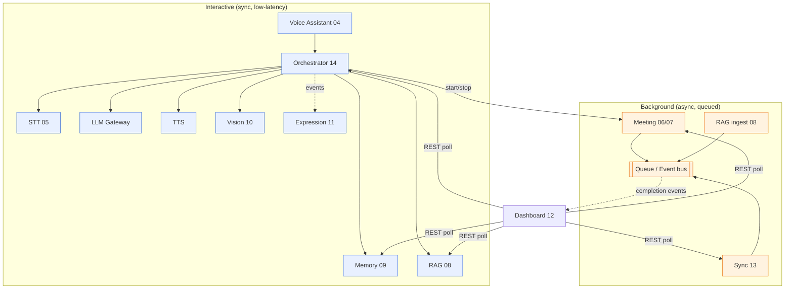
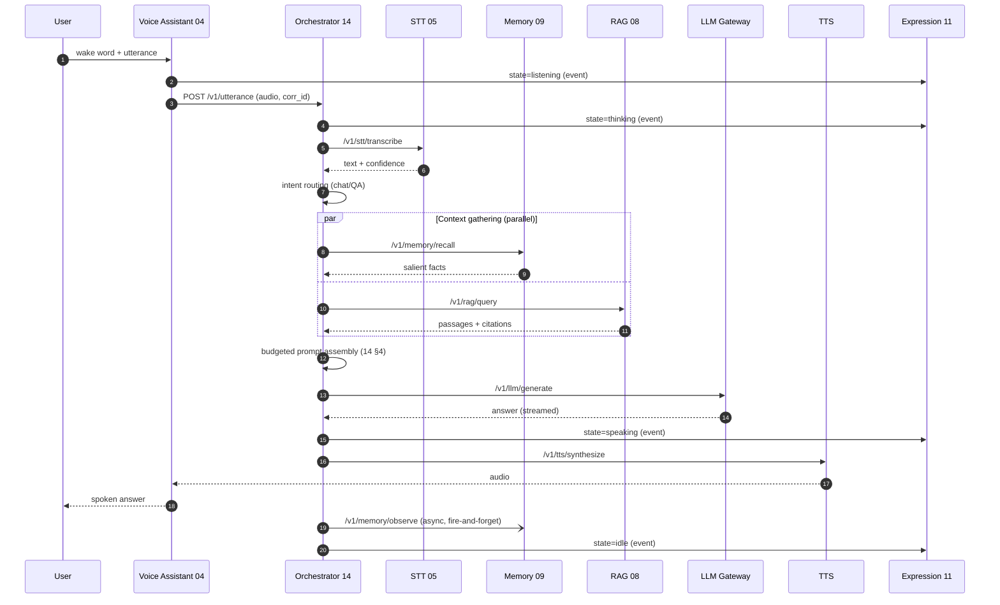
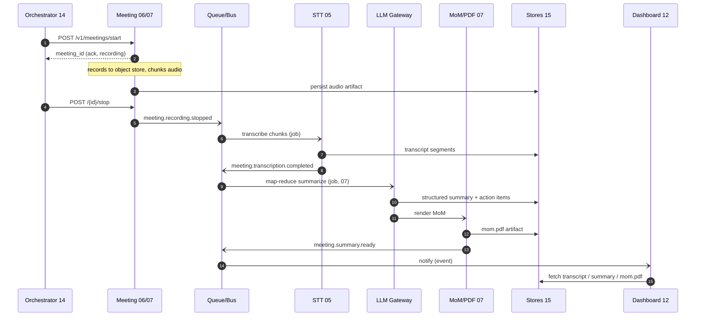
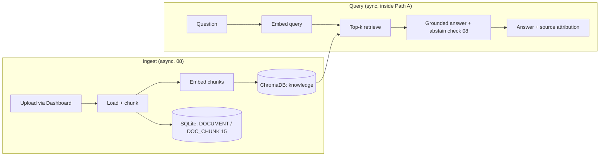
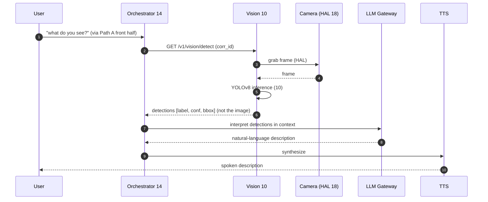

# 17 — Module Interaction Diagram

**Phase:** cross-cutting (validated at Phase 12, System Orchestrator)
**Purpose:** Show how the independent services actually wire together at runtime. Where the module docs (`04`–`16`) each describe *one* component, this document traces the *end-to-end* paths that cross service boundaries — the voice loop, the meeting pipeline, a grounded RAG query, and a vision query — so the system can be reasoned about as a whole.

---

## Purpose

A service-oriented system is only as clear as its interaction maps. This doc is the "wiring diagram": for each user-visible flow it names every hop, the call style (sync vs. async), the data that crosses, and where `corr_id` and events are emitted. It is the reference used during integration (Phase 12) and debugging (`19`).

## Scope

In: cross-service sequence/flow diagrams for the four primary runtime paths, the synchronous vs. asynchronous boundary, and the shared concerns (`corr_id`, events) that thread through all of them. Out: component internals (each module doc), contract shapes (`16`), data schema (`15`). Realizes the canonical sequence in `03 §9` and the orchestrator pipeline in `14`.

---

## 1. The big picture — who talks to whom

Two regimes, one rule (`03 §4`, `16 §1`): the **interactive path is synchronous request/response** because the human is waiting; **long work is asynchronous** over the queue/event bus so nothing blocks the voice loop. The orchestrator is the only service that fans out to the interactive set; the dashboard never drives logic, it only reads.

## 2. Path A — Voice interaction loop

The headline flow: spoken question → spoken grounded answer. This is the path NFR-LAT-1 (interactive latency budget, `01`) is measured against.

Key interaction facts: **memory recall and RAG run in parallel** (`14 §3`) to protect the latency budget; **memory write-back is async** (the `-)` arrow) so it never delays the response; **expression is driven by fire-and-forget events**, never blocking the pipeline (`11`). If RAG or memory is slow/down, the orchestrator degrades rather than stalls (`14 §6`, §6 below).

## 3. Path B — Meeting pipeline (record → transcript → summary → MoM)

Triggered by a voice command ("start the meeting") or the dashboard. Entirely asynchronous after the start acknowledgement.

Key interaction facts: each stage **hands off via an event** and reads/writes through the stores (`15`), so a slow transcription never blocks the voice loop running concurrently. The dashboard learns the work is done **by event**, then fetches artifacts on demand. This pipeline is the embodiment of AD-2 (async for heavy work) and the staged events of `16 §4`.

## 4. Path C — Knowledge ingestion + grounded query

Two sub-flows: a background **ingest** that populates the vector store, and the synchronous **query** embedded inside Path A.

Key interaction facts: **ingest and query share one embedding model and one collection** — the version-pinning concern in `21` (embedding mismatch) lives exactly here. Retrieval returns **passages plus citations**; the orchestrator passes them into prompt assembly, and the abstention rule (answer only from retrieved context, else say so) is what backs the RAG-faithfulness eval in `19`.

## 5. Path D — Vision query (on-demand)

Vision is **pull, not push**: the orchestrator asks "what do you see?" only when intent calls for it. The camera feed never streams through the orchestrator.

Key interaction facts: Vision returns **structured detections, not video** (`10`), keeping payloads small and privacy-preserving (NFR-PRIV-1). The camera is reached only through the **Device HAL** (`18`), so the same flow works when the camera moves from the laptop to the robot.

## 6. Cross-cutting interactions

These concerns appear in *every* path above and are the reason the system stays observable and resilient.

| Concern | How it threads through the modules |
|---|---|
| **Correlation** | `corr_id` is minted at the voice/dashboard edge and propagated on every call and event (`16 §1`); one ID reconstructs a whole interaction across services for tracing (`19`). |
| **Events → Expression/Dashboard** | State changes (`voice.*`) and job completions (`meeting.*`, `rag.*`, `sync.*`) are emitted fire-and-forget; Expression and Dashboard subscribe, never block producers (`11`, `12`, `16 §4`). |
| **Graceful degradation** | If a context source (Memory/RAG) or an output (TTS) is slow or down, the orchestrator drops it and continues per the degradation table (`14 §6`) rather than failing the turn. |
| **Health/readiness** | Every service exposes `/health` + `/ready` (`16 §1`); the orchestrator aggregates them and the dashboard surfaces them. |
| **Stores as integration seam** | The meeting and ingest pipelines integrate *through* the stores (`15`), not through direct calls — decoupling producers from consumers. |

## Design decisions

- **Orchestrator-centric fan-out** — only one service composes the interactive path, so there is exactly one place that knows the end-to-end flow (AD-3, `14`). Services don't call each other peer-to-peer on the hot path.
- **Sync edge / async core** — the synchronous boundary is drawn tightly around the human-waiting path; everything else is queued (AD-2). This single rule explains every arrow style above.
- **Pull-based vision, event-based notification** — vision is requested on demand and background jobs announce completion by event, minimizing always-on data movement and keeping the dashboard a pure reader.
- **Integrate through contracts and stores** — modules meet only at `libs/contracts` shapes (`16`) and the storage adapters (`15`), which is what lets a service relocate to the cloud (`18`) without rewiring callers.

## Technology choices

| Need | Choice | Why |
|---|---|---|
| Diagram source of truth | Mermaid in-repo | Versioned with code; renders on GitHub; diffable in review |
| Sync transport | HTTP/JSON (FastAPI) | Simple, debuggable, OpenAPI-documented (`16`) |
| Async transport | Queue + event bus (embedded Redis → managed) | Decouples producers/consumers; survives slow stages |
| Trace stitching | `corr_id` propagation | One ID across all hops; no distributed-tracing infra required in Stage 1 |

## Future scalability considerations

- **Distributed tracing** (OpenTelemetry) can replace manual `corr_id` correlation when the fleet grows — the `corr_id` is already the span key.
- **Edge/cloud split** (`18`): Paths A/D keep their latency-sensitive hops on the edge while LLM/RAG hops cross to the cloud; the diagrams don't change, only the network distance does.
- **Saga/compensation** for the meeting pipeline if multi-step failures need rollback at scale.
- **Backpressure** on the queue so ingest/meeting surges can't starve interactive work.

## Implementation notes

- Treat these four diagrams as the integration checklist for Phase 12: each arrow is a contract test in `19`.
- Log the `corr_id` at every hop in these paths; an interaction that can't be reassembled from logs is a defect.
- When adding a feature, add (or extend) one of these maps *first* — the diagram is the design review artifact, and the absence of a path here means the feature isn't wired.
- Keep Vision and the camera feed off the orchestrator's hot path; if a future feature needs continuous frames, route them service-to-service, not through `14`.
