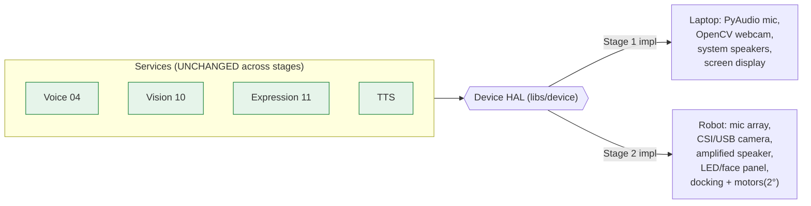
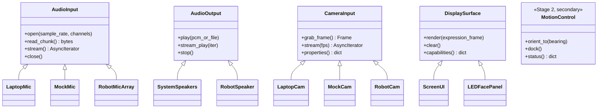
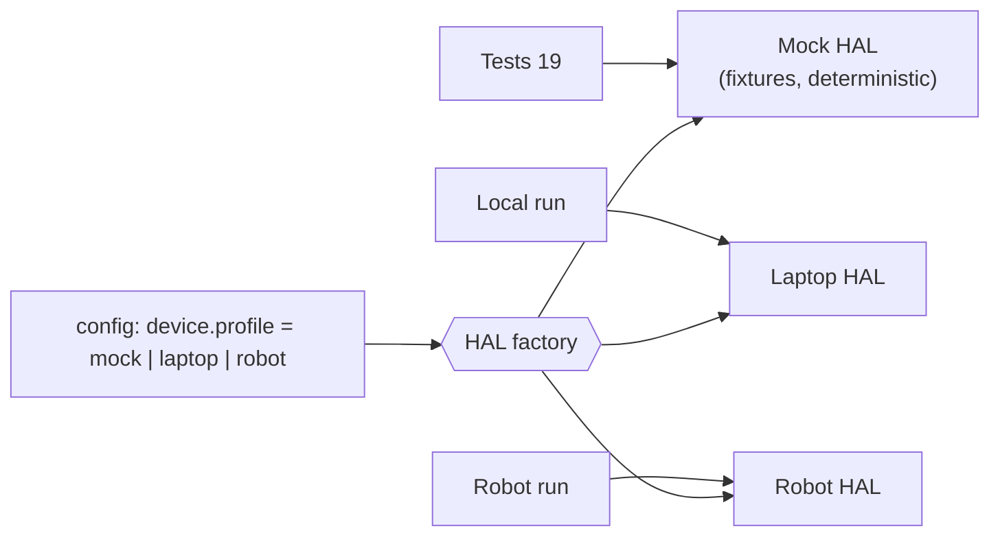
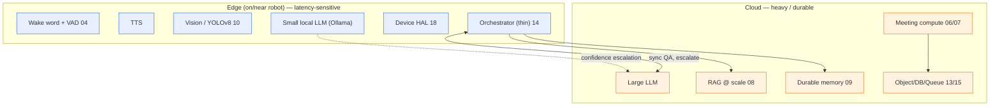
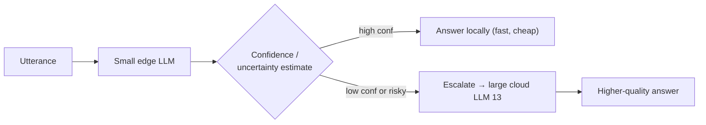

# 18 — Hardware Migration Strategy

**Phase:** 13 — Hardware Migration Strategy
**Purpose:** Define exactly how the Stage-1 laptop system becomes the Stage-2 robot — without a redesign. The mechanism is the **Device Hardware Abstraction Layer (HAL)** introduced in `03 §5`: every interaction with the physical world goes through an interface, so migration is *implementing interfaces and editing config*, not rewriting services.

---

## Purpose

Make hardware a swappable detail. In Stage 1 the "hardware" is the laptop's mic, camera, and speakers; in Stage 2 it's robot-grade I/O on an edge compute board, with heavy AI in the cloud. This document specifies the HAL contracts, the mock→real swap, the edge/cloud partition, and the migration sequence — proving the prime directive that the architecture supports migration *without major redesign* (NFR-PORT-1, `01`).

## Scope

In: the Device HAL interfaces and their Stage-1/Stage-2 implementations, edge vs. cloud service partitioning, the migration runbook, and the confidence-escalation extension point. Out: CAD/mechanical design (Fusion 360 deliverable), navigation/SLAM/manipulation (explicitly out of scope, `01`), provider IaC (`20`). Implements FR for Stage-2 readiness; realizes AD-4 (HAL) and AD-6 (edge/cloud split).

---

## 1. The migration principle

**Nothing above the HAL line changes.** A service asks the HAL for a frame, a mic stream, an audio sink, or a display surface; it never knows whether that resolves to a laptop webcam or a robot camera. Migration = a second set of implementations behind the same interfaces + a config switch (`03 §5`). This is the single most important property of the whole design.

## 2. Device HAL contracts

The HAL (`libs/device`) defines narrow capability interfaces. Each has a Stage-1 (laptop), a **mock** (test), and a Stage-2 (robot) implementation.

| Interface | Stage 1 impl | Mock impl | Stage 2 impl |
|---|---|---|---|
| `AudioInput` | Laptop mic (PyAudio/sounddevice) | WAV file player | Robot mic array (+ beamforming hook for Sound Tracking) |
| `AudioOutput` | System speakers | /dev/null sink | Amplified robot speaker |
| `CameraInput` | Laptop webcam (OpenCV) | Image/video fixture | Robot CSI/USB camera |
| `DisplaySurface` | Streamlit/desktop window (`11`,`12`) | No-op recorder | LED matrix / small panel face |
| `MotionControl` *(secondary)* | n/a (no motion in Stage 1) | logs intents | 2-DOF: orient (Sound Tracking) + dock (Autonomous Docking) |

Note the scope guardrail: `MotionControl` covers **only** the two secondary features (Sound Tracking orientation, Autonomous Docking). There is deliberately **no** interface for navigation, mapping, or manipulation — those are out of scope (`01`, `21` scope-creep risk).

## 3. Mock → real swap (and why it exists from day one)

The mock implementations are written in Stage 1, *before* any robot exists. This is what lets the system be developed and tested entirely on a laptop while remaining honest about the eventual hardware seam.

| Profile | Used for | Resolves to |
|---|---|---|
| `mock` | CI, unit/integration tests (`19`) | Deterministic fixtures; no devices needed |
| `laptop` | Stage-1 development & demo (`22`) | Real laptop mic/cam/speaker/screen |
| `robot` | Stage-2 deployment | Robot I/O + edge board drivers |

Selecting hardware is a one-line config change (`device.profile`), resolved by a HAL factory at startup. No service imports a device library directly — they import the interface.

## 4. Edge / cloud partition (Stage 2)

Migration isn't only laptop→robot; it's also *one box → edge+cloud*. The split follows latency and sensitivity (AD-6, `03 §6`, `13`).

| Tier | Resident services | Rationale |
|---|---|---|
| **Edge** | Wake word, VAD, TTS, Vision (YOLOv8), small LLM, thin orchestrator, Device HAL | Must respond locally; tolerate intermittent connectivity; keep raw audio/video local (NFR-PRIV-1) |
| **Cloud** | Large LLM, RAG at scale, durable memory, meeting transcription/summarization, object/DB/queue | Compute-heavy, benefits from scale, durable, shareable across a fleet |

The edge stays useful offline: local STT/TTS and the small LLM keep basic interaction alive; cloud features degrade gracefully (`14 §6`) when the link is down.

## 5. Confidence-based escalation (extension point)

The edge/small-model path includes a designed hook: when the small local model is likely to be **confidently wrong**, the orchestrator escalates the turn to the large cloud model instead of answering locally.

This is an **architectural extension point**, not a Stage-1 deliverable: the orchestrator already centralizes routing (`14 §2`) and the LLM Gateway already abstracts model choice (`16`), so escalation slots in as a routing policy without touching other services. It is the natural place to later plug in a learned escalation signal; for the internship it is documented as a forward hook so the edge/cloud design is honest about quality/latency/cost trade-offs.

## 6. Migration sequence (runbook)

```mermaid
flowchart LR
    s1["1. Freeze Stage-1\nservices + contracts"] --> s2["2. Containerize\n(already Docker) 20"]
    s2 --> s3["3. Implement Robot HAL\n(audio/cam/display)"]
    s3 --> s4["4. Bench test on edge\nboard w/ mock cloud"]
    s4 --> s5["5. Move heavy services\nto cloud 13/20"]
    s5 --> s6["6. Wire edge↔cloud\n(auth+TLS) 16"]
    s6 --> s7["7. Add MotionControl\n(Sound Track + Dock)"]
    s7 --> s8["8. Field validation\nvs. acceptance 22"]
```

| Step | Risk touched (`21`) | Validation |
|---|---|---|
| Robot HAL impl | Device driver variance | Same HAL contract tests, `robot` profile (`19`) |
| Edge bring-up | CPU/latency on smaller compute | Re-run latency budget NFR-LAT-1 on target board |
| Cloud move | Portability / lock-in | Capability interfaces unchanged (`13`); swap provider impls only |
| Edge↔cloud link | Connectivity loss | Degradation table holds (`14 §6`); offline smoke test |
| MotionControl | Scope creep into navigation | Hard interface boundary: orient + dock only |

## Design decisions

- **HAL is the entire migration strategy** — because services depend only on interfaces (AD-4), the laptop→robot move is additive (new implementations) rather than invasive. This is the property the whole Stage-1/Stage-2 split rests on.
- **Mocks first** — writing mock devices in Stage 1 forces the HAL boundary to be real and keeps tests hardware-free (`19`); it also de-risks Stage 2 because the interfaces were exercised long before hardware arrived.
- **Partition by latency + sensitivity, not by convenience** — interactive and privacy-bearing work stays on the edge; heavy/durable/shareable work goes to the cloud (AD-6), which is also what keeps the robot useful offline.
- **Motion is minimal and bounded** — only the two secondary features get actuators; the explicit absence of nav/SLAM/manipulation interfaces is a deliberate guardrail against scope creep (`21`).
- **Escalation as a hook, not a feature** — documenting the confidence-escalation extension point keeps the edge/cloud design intellectually honest without committing internship time to a research feature.

## Technology choices

| Need | Choice | Why |
|---|---|---|
| Abstraction mechanism | Python ABCs / Protocols in `libs/device` | Enforced interface; trivial mock/real swap |
| Profile selection | Config (`device.profile`) + factory | One switch chooses mock/laptop/robot |
| Edge compute (Stage 2) | Containerized services on an edge board | Same Docker images as Stage 1 (`20`) |
| Edge↔cloud transport | HTTPS/TLS + token (Stage 2) | Same `/v1` contracts (`16`), secured |
| Motion (secondary) | 2-DOF controller behind `MotionControl` | Scoped to orient + dock only |

## Future scalability considerations

- **Fleet of robots**: cloud tier already multi-tenant via stores (`15`) and capability interfaces (`13`); edge images are identical units.
- **Heterogeneous edge hardware**: new boards = new HAL implementations; services and contracts untouched.
- **Smarter escalation**: replace the threshold in §5 with a learned signal; the routing seam is already in place.
- **Hardware-accelerated inference** on the edge (NPU/GPU): a Vision/LLM implementation detail behind existing interfaces, not an architecture change.

## Implementation notes

- Keep `libs/device` free of business logic — purely device adapters; this is what makes the contract tests in `19` portable across profiles.
- Run the full contract test suite under the `mock` profile in CI and under `laptop` before any demo; gate Stage-2 promotion on passing under `robot`.
- Re-measure NFR-LAT-1 on the actual edge board early — CPU-only latency on smaller hardware is a top risk (`21`); discovering it at field-validation time is too late.
- Treat the edge/cloud boundary as a network in tests from the start (add latency/jitter in integration), so degradation paths (`14 §6`) are exercised before the robot is in the field.
