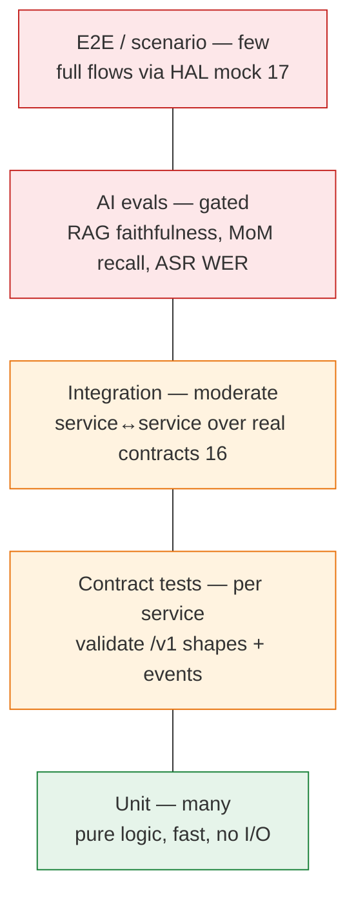
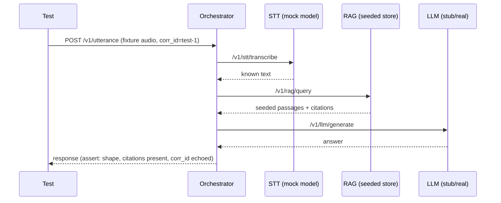
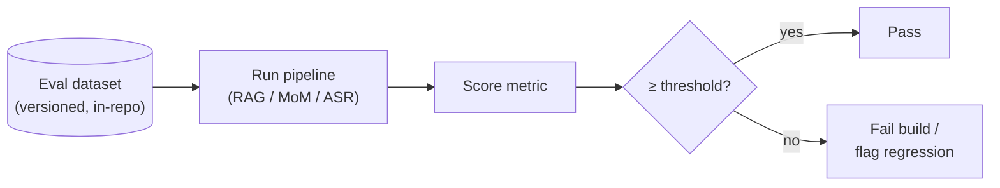
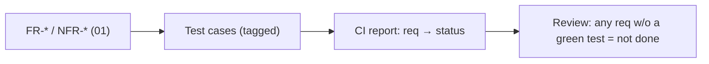

# 19 — Testing Strategy

**Phase:** 14 — Testing
**Purpose:** Define how the system is verified — the test pyramid (unit/integration/e2e), the **AI-specific evaluations** that classic tests can't cover (RAG faithfulness, action-item recall), requirement traceability back to the FR/NFR IDs in `01`, and the CI pipeline that runs it all on every change.

---

## Purpose

A multi-service AI system fails in two distinct ways: software defects (wrong wiring, broken contracts) and *quality regressions* (the model starts hallucinating, summaries miss action items). This document covers both — deterministic testing for the software and evaluation harnesses for the AI — and ties every check to a requirement so "done" is measurable, not vibes.

## Scope

In: the test pyramid and what lives at each layer, contract testing, AI evaluation datasets/metrics/thresholds, non-functional testing (latency/load), requirement traceability, CI/CD gates, and `corr_id`-based debugging. Out: per-module algorithm internals (each module doc), deployment mechanics (`20`). Verifies FR-* and the NFR-* targets defined in `01`.

---

## 1. Test pyramid

| Layer | What it checks | Runs against | Speed/volume |
|---|---|---|---|
| **Unit** | Pure functions: chunkers, prompt assembly, salience scoring, parsers | In-process, no I/O | Many, milliseconds |
| **Contract** | Each service's `/v1` request/response + event shapes match `libs/contracts` (`16`) | Single service + `mock` HAL | Per-service, fast |
| **Integration** | Real service-to-service paths (orchestrator→STT→RAG→LLM→TTS) | Several services, `mock` devices (`18`) | Moderate |
| **AI eval** | Output *quality* against labeled datasets + thresholds | Models + pipelines | Gated, slower |
| **E2E / scenario** | Whole user flows from `17` end to end | Full stack, `mock` HAL | Few, slowest |

The pyramid leans on the architecture: because services meet only at contracts (`16`) and devices only at the HAL (`18`), the bottom three layers run **without any hardware** under the `mock` profile.

## 2. Contract & integration testing

- **Contract tests** validate inbound *and* outbound payloads against the shared `pydantic` models (`16`), so a service can't silently change its API. CI diffs each service's generated OpenAPI to catch breaking changes.
- **Integration tests** seed a known RAG store and memory, stub the LLM where determinism matters, and assert the *wiring* from `17` (parallel context gather, async memory write-back, degradation when a dependency is killed).
- Every test threads a known `corr_id` and asserts it is echoed/propagated — making the trace itself a tested property (NFR-OBS-1).

## 3. AI evaluation (the part unit tests can't do)

Model outputs are non-deterministic and degrade silently, so each AI capability has a **labeled dataset, a metric, and a threshold tied to an NFR**. These run as gated CI jobs (§5) and on model/prompt changes.

| Capability | Dataset | Metric | Threshold | Backs |
|---|---|---|---|---|
| **RAG faithfulness** (`08`) | Q→context→grounded-answer pairs + adversarial "not in context" Qs | Faithfulness / groundedness (answer supported by retrieved passages); abstains when it should | **≥ 90%** | NFR-ACC-1 |
| **MoM action-item recall** (`07`) | Annotated meeting transcripts → gold action items | Recall of action items (and owner/assignee correctness) | **≥ 80%** | NFR-ACC-2 |
| **ASR accuracy** (`05`) | Reference audio + transcripts (incl. accents/noise) | Word Error Rate (WER) | WER ≤ target | NFR-ACC (ASR) |
| **RAG retrieval** (`08`) | Q→relevant-chunk labels | Recall@k / MRR | tracked, trend-gated | NFR-ACC-1 |
| **Summary quality** (`07`) | Transcript→reference summary | ROUGE + spot LLM-as-judge | tracked | NFR-ACC-2 |
| **Routing** (`14`) | Utterance→intent labels | Intent accuracy | tracked | FR-ORC |

Principles: datasets are **versioned in-repo** and grow from real failures (a bug becomes a test case); faithfulness explicitly rewards **abstention** so the system is graded on *not* hallucinating; LLM-as-judge is used only as a secondary, sampled signal, never the sole gate.

## 4. Non-functional testing

| NFR (`01`) | Test | Pass condition |
|---|---|---|
| **NFR-LAT-1** (interactive latency) | Time the Path-A loop (`17`) per stage on target hardware | End-to-end within budget; per-hop breakdown logged |
| **NFR-AVAIL / RES** (resilience) | Kill Memory/RAG/TTS mid-flow | Orchestrator degrades, turn still completes (`14 §6`) |
| **NFR-PORT-1** (portability) | Run suite under `mock`/`laptop`; swap a storage adapter | Same tests pass; no service code change (`13`,`18`) |
| **NFR-PRIV-1** (privacy) | Assert Vision returns detections not frames; raw-audio retention policy | No raw media leaves the boundary unexpectedly (`10`,`21`) |
| **NFR-OBS-1** (observability) | `corr_id` propagation; `/health`+`/ready` present | One ID reconstructs a flow; health endpoints respond |
| Load (meeting/ingest) | Concurrent meetings + ingest while voice loop runs | Queue absorbs load; interactive path unaffected (backpressure) |

## 5. CI/CD pipeline (GitHub Actions)

```mermaid
flowchart LR
    push["push / PR"] --> lint["Lint + type check"]
    lint --> ut["Unit tests"]
    ut --> ct["Contract tests + OpenAPI diff"]
    ct --> it["Integration (mock HAL)"]
    it --> ev["AI evals (gated thresholds §3)"]
    ev --> bld["Build Docker images 20"]
    bld --> e2e["E2E scenarios"]
    e2e --> rep["Publish: coverage,\neval scores, trace samples"]
    classDef gate fill:#fff3e0,stroke:#e8710a;
    class ev gate;
```

| Stage | Gate | On failure |
|---|---|---|
| Lint/type | Style + types clean | Block merge |
| Unit/contract | All pass; OpenAPI no breaking diff | Block merge |
| Integration | Wiring + degradation pass (`17`) | Block merge |
| **AI evals** | Metrics ≥ thresholds (§3) | Block merge / flag regression |
| Build | Images build, compose up healthy (`20`) | Block deploy |
| E2E | Primary scenarios pass | Block deploy |

Fast layers (lint→integration) run on every PR; the heavier eval/e2e stages gate merge to main and pre-deploy. Eval scores are published as a trend so slow quality drift is visible, not just hard failures.

## 6. Requirement traceability

Every requirement in `01` maps to at least one test, and every test names the requirement it covers — so coverage is *of requirements*, not just lines.

| Example requirement | Verified by |
|---|---|
| FR-RAG-* grounded answers w/ citations | Contract (citations present) + RAG faithfulness eval (§3) |
| FR-MOM-* action items in MoM | MoM recall eval (§3) + PDF render contract |
| FR-VA-* voice loop | E2E Path-A scenario (`17`) |
| FR-ORC-* routing + degradation | Routing eval + resilience tests (§4) |
| NFR-LAT-1 | Latency test (§4) |
| NFR-PORT-1 | Adapter-swap test (§4) |

## Design decisions

- **Two verification regimes** — deterministic tests for software, evaluation harnesses for AI quality; treating model outputs like ordinary asserts would either be flaky or miss silent quality regressions, so they're graded statistically against thresholds.
- **Thresholds are the NFRs** — RAG faithfulness ≥ 90% and action-item recall ≥ 80% are not arbitrary; they are NFR-ACC-1/2 from `01`, which is what makes the eval gate meaningful.
- **Hardware-free by construction** — the `mock` HAL (`18`) and contract-only coupling (`16`) let the whole pyramid run in CI with no devices, which is what keeps tests fast and Stage-1-appropriate.
- **Tests track requirements, not files** — traceability (§6) means "done" is "every FR/NFR has a green test," catching gaps a coverage percentage would hide.
- **Failures become fixtures** — every bug/hallucination is added to the relevant dataset so the suite hardens over time rather than re-discovering the same defect.

## Technology choices

| Need | Choice | Why |
|---|---|---|
| Test runner | `pytest` | Standard, fixtures, parametrization, async support |
| Contract/schema | `pydantic` models from `libs/contracts` | Same source of truth as runtime (`16`) |
| API tests | FastAPI `TestClient` / httpx | Exercise real endpoints in-process |
| ASR metric | WER (jiwer-style) | Standard transcription metric (`05`) |
| Summary metric | ROUGE + sampled LLM-as-judge | Lexical + semantic signal (`07`) |
| RAG eval | Faithfulness/recall harness over seeded store | Grades grounding + abstention (`08`) |
| CI | GitHub Actions | Matches Git/GitHub stack (`02`); easy gating |
| Load | Locust/k6-style driver | Concurrency on meeting/ingest paths |

## Future scalability considerations

- **Golden-transcript regression suite** grows with real meetings; nightly eval trend dashboard.
- **Shadow/canary evals** in Stage 2: score a % of live traffic offline before promoting a model/prompt.
- **Distributed tracing** (OpenTelemetry) replaces manual `corr_id` assertions as the fleet grows (`17`).
- **Hardware-in-the-loop** tests once robot HAL exists: same contract suite under the `robot` profile (`18`).
- **Cost/latency budgets per model** added to eval gates when edge/cloud escalation (`18 §5`) is live.

## Implementation notes

- Keep eval datasets small but adversarial — a handful of "answer isn't in the context" cases catches hallucination faster than hundreds of easy questions.
- Stub the LLM in integration tests where you need determinism; run the *real* model only in the eval stage so wiring tests stay fast and stable.
- Assert `corr_id` propagation in at least one test per service; an un-traceable flow is a defect (NFR-OBS-1).
- Fail the build on eval regressions, but report scores as a trend too — a drop from 94%→91% (still passing) is an early warning worth seeing.
- Run the resilience tests (kill a dependency) in CI, not just manually — graceful degradation (`14 §6`) is a feature and must stay tested.
