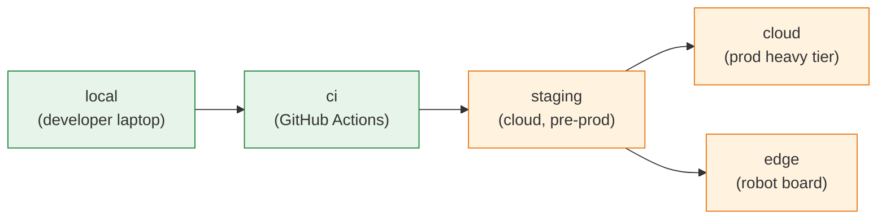
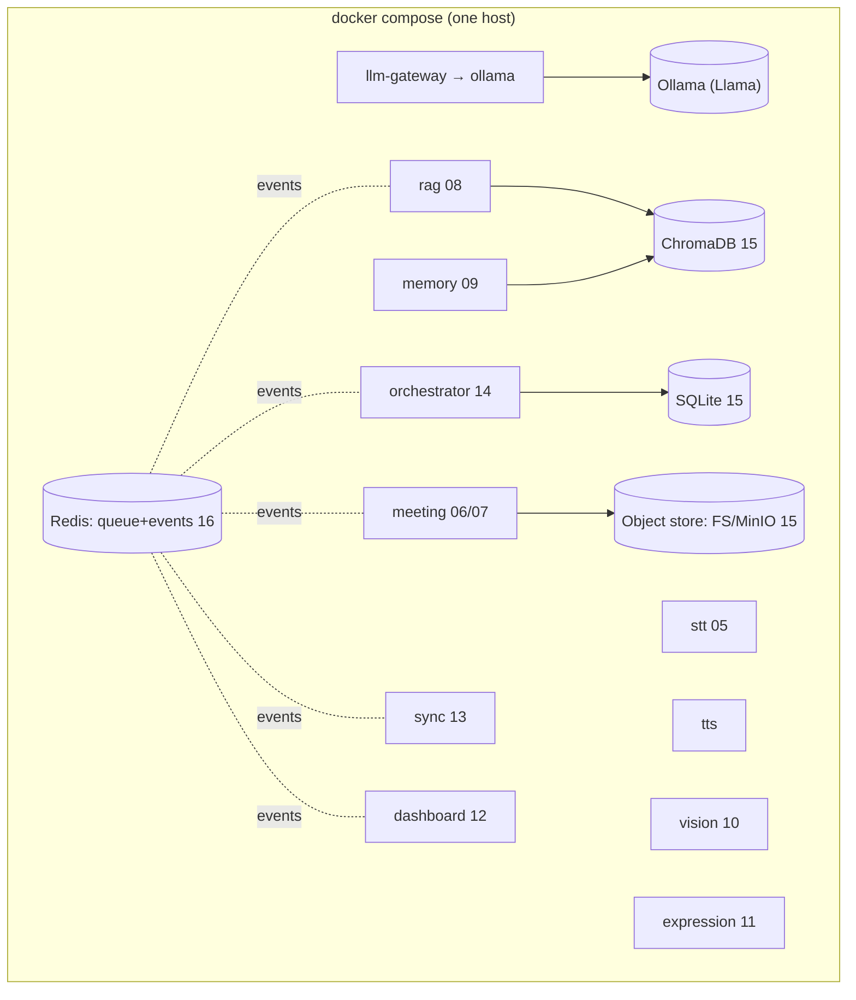
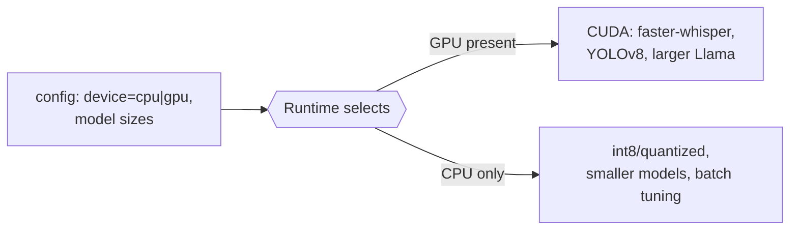
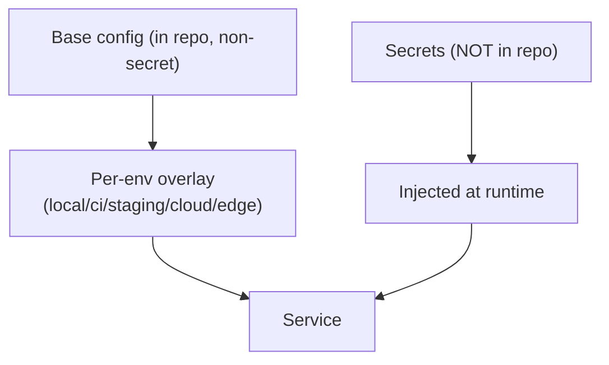
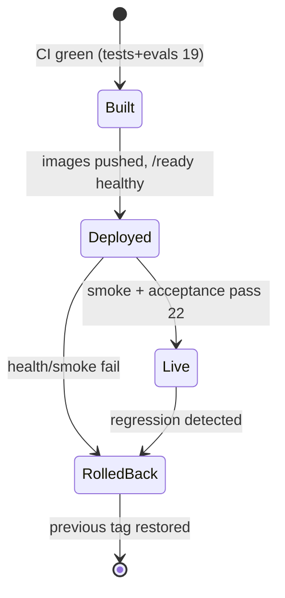

# 20 — Deployment Plan

**Phase:** 15 — Deployment
**Purpose:** Define how the system is packaged, configured, and rolled out across environments — from a single-command **local `docker compose`** stack (Stage 1) to **cloud** services and **edge** devices (Stage 2) — including GPU configuration, environment/secrets management, health gating, and rollback.

---

## Purpose

Make deployment boring and repeatable. Because every capability is already a containerized service (AD-5, `03`), "deploy" means *run the same images in a different place with different config*. This document specifies the environments, the rollout order, how models and GPUs are handled, and how to safely roll back.

## Scope

In: environment matrix (local/ci/staging/edge/cloud), the Stage-1 compose stack, model provisioning, GPU/CPU configuration, secrets/config strategy, the Stage-2 cloud + edge rollout, and rollback. Out: provider-specific IaC scripts (a Stage-2 build task), test definitions (`19`), HAL/hardware specifics (`18`). Realizes AD-5 (containers everywhere) and NFR-PORT-1, NFR-AVAIL.

---

## 1. Environment matrix



| Env | Stage | HAL profile (`18`) | Purpose | Cloud deps |
|---|---|---|---|---|
| `local` | 1 | `laptop` | Dev + demo on one machine | None (fully offline) |
| `ci` | 1 | `mock` | Automated tests/evals (`19`) | None |
| `staging` | 2 | `mock`/`robot` | Pre-prod validation | Reference provider |
| `cloud` | 2 | n/a (server) | Heavy/durable tier (`13`,`18 §4`) | Provider services |
| `edge` | 2 | `robot` | On-robot latency-sensitive tier | Talks to `cloud` |

Same images, different config — the only things that change between environments are config values, the HAL profile, and which tier a service runs in.

## 2. Stage-1 deployment — local compose (the default)

The entire Stage-1 platform comes up with one command. This is also the demo environment (`22`).



| Concern | Stage-1 approach |
|---|---|
| Orchestration | `docker compose up` brings up all services + dependencies |
| Service discovery | Compose network DNS (service names) |
| Models | Ollama pulls Llama models on first run; Whisper/YOLOv8 weights cached in a volume |
| Data | Named volumes for SQLite, ChromaDB, object store, model cache (survive restarts) |
| Startup order | `depends_on` + `/ready` gating: orchestrator waits for STT/LLM/RAG to be ready (`16 §1`) |
| Bring-up time | First run slow (model pulls); subsequent runs fast (cached volumes) |

## 3. Model provisioning & GPU/CPU configuration

The heaviest deployment variable is models and the hardware they run on.



| Model | GPU path | CPU-only path (Stage-1 reality) |
|---|---|---|
| Whisper (`05`) | faster-whisper on CUDA | `base`/`small` int8, accept higher RTF |
| Llama via Ollama | GPU offload, larger params | Quantized (e.g. 4-bit), smaller params |
| YOLOv8 (`10`) | CUDA inference | `n`/`s` variant, on-demand only |
| Embeddings (`08`,`09`) | batched on GPU | CPU batch; **pin model version** (`21`) |

CPU-only latency is a known top risk (`21`); the deployment config exposes model-size and quantization knobs precisely so the latency budget (NFR-LAT-1) can be met on whatever hardware is present. GPU is auto-detected and used when available, with a clean CPU fallback.

## 4. Configuration & secrets



| Item | Strategy |
|---|---|
| Non-secret config | Versioned in repo; per-environment overlay files |
| HAL profile | `device.profile` selects mock/laptop/robot (`18`) |
| Cloud capability bindings | Provider impls chosen by config (`13`); no code change to switch provider |
| Secrets | `.env` (gitignored) locally → secrets manager in Stage 2 (`13`); never committed |
| Feature flags | Config toggles (e.g. cloud sync on/off) so cloud is never a hard dep (`13`) |

The 12-factor split (config in the environment, secrets injected) is what lets one image run in five environments without rebuilding.

## 5. Stage-2 rollout — cloud + edge

Migration order follows `18 §6`; deployment-side, it's a tiered rollout with health gates.

```mermaid
sequenceDiagram
    autonumber
    participant CI as CI 19
    participant REG as Image registry
    participant CLD as Cloud tier 13
    participant EDG as Edge/robot 18
    CI->>REG: build + push images (tagged)
    CI->>CLD: deploy heavy tier (LLM, RAG, memory, meeting, stores)
    CLD-->>CI: /ready healthy
    CI->>EDG: deploy edge tier (wake/VAD/TTS/vision/small-LLM/thin-orc)
    EDG->>CLD: connect (TLS+token) 16
    EDG-->>CI: /ready healthy + offline smoke ok
    Note over CLD,EDG: validate vs acceptance 22; degrade-on-link-loss verified 14 §6
```

| Tier | Deploy target | Notes |
|---|---|---|
| Cloud heavy | Container service (ECS/EKS-class) + managed stores (`13`) | Scales independently; durable data |
| Edge | Same images on robot board, `robot` profile | Latency-sensitive set; works offline |
| Link | HTTPS/TLS + token (`16`) | Edge degrades gracefully if cloud unreachable (`14 §6`) |

Reference provider is AWS (`13`), but every binding is config — staging can run on the company's own infra or another cloud without touching service code (NFR-PORT-1).

## 6. Release gating & rollback



| Mechanism | How |
|---|---|
| Gate | No deploy unless CI tests **and** eval thresholds pass (`19 §5`) |
| Health gate | Promote only when `/ready` healthy across services (`16 §1`) |
| Immutable tags | Every release is a tagged image set; "rollback" = redeploy previous tag |
| Data migrations | Alembic, forward-compatible (`15`); avoid destructive migrations in a release |
| Model rollback | Models are versioned/pinned; revert model config to prior version (`21`) |
| Local rollback | `docker compose` pin to previous image tags |

## Design decisions

- **Containers are the deployment unit everywhere** — because services were Dockerized from Phase 1 (AD-5), there is no separate "make it deployable" effort; local, cloud, and edge run the *same* images, differing only by config.
- **One command for Stage 1** — `docker compose up` is the whole local/demo deployment, which keeps the inner loop fast and the demo (`22`) reproducible on any machine.
- **Config-driven everything** — HAL profile, provider bindings, model sizes, and feature flags are all config; this is the concrete mechanism behind portability (NFR-PORT-1) and the cloud-optional guarantee (`13`).
- **GPU optional, CPU honest** — auto-detect GPU but ship a working quantized CPU path, because Stage 1 runs on a laptop and CPU latency is a real constraint (`21`).
- **Promote on health + evals, roll back by tag** — releases are immutable image sets gated on `19`'s results and `/ready`, so rollback is trivial and safe.

## Technology choices

| Need | Choice | Why |
|---|---|---|
| Local orchestration | Docker Compose | One-command full stack; matches dev machine |
| Images | Docker | Same artifact across all environments (AD-5) |
| LLM runtime | Ollama (+ Llama) | Local-first, simple model pulls, GPU/CPU (`14`) |
| Vector store | ChromaDB (embedded → server) | Stage-1 simple, Stage-2 scalable (`08`,`15`) |
| Queue/events | Redis (embedded) → managed (`13`) | Same contracts, scales out (`16`) |
| Cloud (reference) | AWS, but config-bound | Portable to Azure/GCP/on-prem (`13`) |
| CI/CD | GitHub Actions | Builds, gates, pushes images (`19`) |
| Secrets | `.env` → secrets manager | No secrets in repo; Stage-2-ready |

## Future scalability considerations

- **Kubernetes** for the cloud tier when the fleet/load grows; compose graduates to Helm charts of the same images.
- **GitOps / IaC** (Terraform) to make staging/cloud reproducible and reviewable.
- **Blue-green / canary** deploys with the eval shadow-traffic idea from `19` before full promotion.
- **Autoscaling** the heavy tier (LLM/RAG/meeting compute) independently of the edge.
- **OTA edge updates** for a robot fleet: signed image rollout + staged canary on a few units first.

## Implementation notes

- Use named volumes for *all* model caches and data stores so `docker compose down/up` doesn't re-pull multi-GB models or lose data.
- Gate orchestrator startup on downstream `/ready` (not just `/health`) so it doesn't accept utterances before STT/LLM/RAG can serve (`16 §1`).
- Keep Stage-1 fully offline by default; cloud sync is a feature flag, not a dependency (`13`) — verify the system runs with networking disabled.
- Pin model versions in config and record them in the release; an embedding-model change silently invalidates the vector store (`21`) and must be a deliberate, migrated release.
- Test rollback before you need it: redeploy the previous image tag in staging as part of release rehearsal.
- Re-measure NFR-LAT-1 in each target environment (laptop, then edge board) — CPU/latency behaviour differs by host (`18`,`21`).
