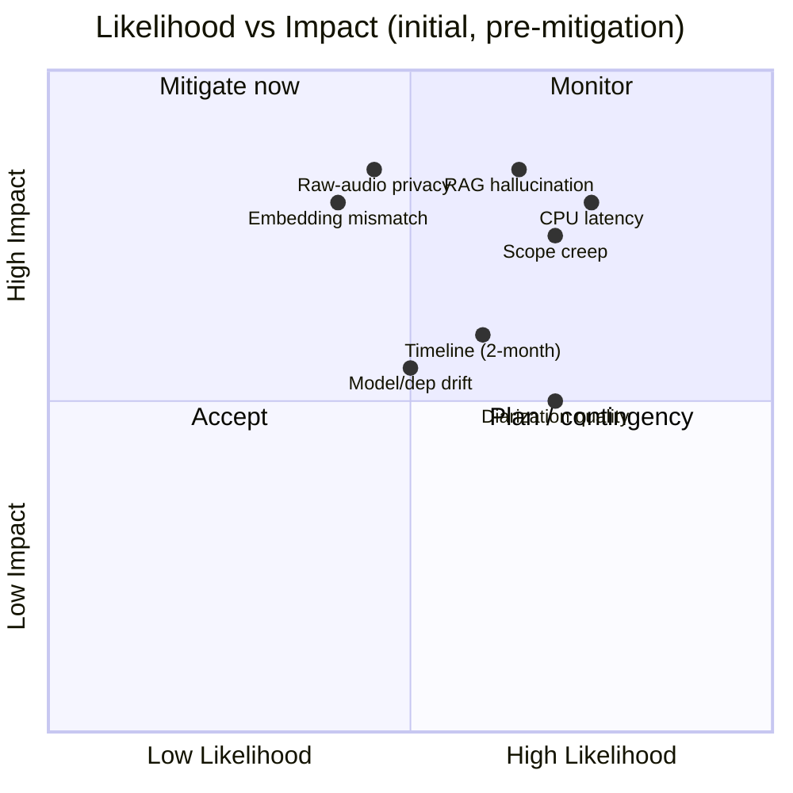

# 21 — Risk Analysis

**Phase:** cross-cutting (maintained throughout; reviewed at each milestone in `02`)
**Purpose:** Identify what can go wrong — technical, AI-quality, scope, privacy, and project risks — and pin each to an owner, a mitigation, a residual rating, and the place in the design where it's handled. This is the living risk register the team reviews at every milestone gate.

---

## Purpose

Surface risk early and make mitigation traceable. Each entry below is rated by **likelihood × impact**, mapped to the NFR it threatens (`01`) and the doc/section that mitigates it, so risk management isn't a one-off document but a checklist that the architecture, tests (`19`), and deployment (`20`) actually answer.

## Scope

In: the full risk register across technical / AI-quality / scope / privacy-security / operational / project dimensions, scoring, mitigations, residual risk, and the top-risk deep dives. Out: implementation of mitigations (lives in the referenced docs). Touches NFR-LAT, NFR-ACC, NFR-PORT, NFR-PRIV, NFR-AVAIL/RES, NFR-SEC, NFR-MAINT from `01`.

---

## 1. How risks are scored

Rating = Likelihood (L) × Impact (I), each Low/Med/High. **Severity** = the resulting priority. **Residual** = the rating that remains *after* the mitigation is in place.

## 2. Technical risks

| ID | Risk | L×I | Threatens | Mitigation | Handled in | Residual |
|---|---|---|---|---|---|---|
| R-T1 | **CPU-only latency** misses interactive budget on a laptop | H×H | NFR-LAT-1 | Quantized/smaller models, faster-whisper, parallel context gather, streaming TTS, GPU auto-use; measure budget per env | `05`,`14 §3`,`18`,`20 §3` | Med |
| R-T2 | **Diarization quality** poor (who-said-what wrong) | H×M | NFR-ACC-2 | Treat diarization as best-effort; summaries degrade gracefully without speaker labels; MoM still extracts action items | `06`,`07` | Med |
| R-T3 | Local LLM (Ollama) **too weak** for grounded reasoning | M×H | NFR-ACC-1 | Right-size model; strong RAG grounding; cloud-LLM escalation hook for hard turns | `08`,`14`,`18 §5` | Med |
| R-T4 | **Service sprawl / integration** fragility (many services) | M×M | NFR-MAINT, NFR-AVAIL | Contract-first (`16`), orchestrator-centric wiring (`17`), contract+integration tests | `16`,`17`,`19` | Low |
| R-T5 | **Vector store growth** degrades retrieval latency/quality | M×M | NFR-LAT, NFR-ACC-1 | Chunk hygiene, top-k tuning, metadata filters; Chroma server / managed in Stage 2 | `08`,`15`,`20` | Low |
| R-T6 | **Async pipeline backpressure**: meeting/ingest surge starves voice loop | M×M | NFR-LAT-1 | Queue isolation of heavy work, backpressure, interactive path stays sync-only | `17 §6`,`14`,`20` | Low |

## 3. AI-quality risks

| ID | Risk | L×I | Threatens | Mitigation | Handled in | Residual |
|---|---|---|---|---|---|---|
| R-A1 | **RAG hallucination** — confident answers not grounded in sources | H×H | NFR-ACC-1 | Answer-only-from-context + **abstention**, source attribution, faithfulness eval gate ≥90% | `08`,`19 §3` | Med |
| R-A2 | **MoM misses action items** | M×H | NFR-ACC-2 | Structured extraction schema, map-reduce summarization, recall eval gate ≥80% | `07`,`19 §3` | Med |
| R-A3 | **ASR errors** on accents/noise corrupt downstream | M×M | NFR-ACC | Model-size config, WER eval on accented/noisy set, confidence surfaced | `05`,`19 §3` | Med |
| R-A4 | **Memory drift** — stale/irrelevant facts pollute context | M×M | NFR-ACC-1 | Salience scoring, forgetting/decay, recall ranking | `09` | Low |
| R-A5 | **Silent quality regression** after model/prompt change | M×H | NFR-ACC-1/2 | Gated evals in CI + trend dashboard; failures become fixtures | `19 §3`,`19 §5` | Low |

## 4. Scope & product risks

| ID | Risk | L×I | Threatens | Mitigation | Handled in | Residual |
|---|---|---|---|---|---|---|
| R-S1 | **Scope creep into out-of-scope robotics** (navigation, SLAM, pick-and-place, exploration, face recognition) | H×H | Timeline, focus | Hard guardrails: no HAL interface for nav/manipulation; `MotionControl` bounded to orient+dock; out-of-scope list enforced in review | `18 §2`,`01` | Med |
| R-S2 | **Stage-2 over-engineering** before Stage-1 is stable | M×M | Timeline | Stage-1-first discipline (`02`); cloud/edge are config, built only after AI modules stabilize | `02`,`13`,`20` | Low |
| R-S3 | **Secondary features** (Sound Tracking, Docking) pulled forward | M×M | Timeline | Sequenced after primaries; bounded to the 2-DOF interface | `02`,`18` | Low |
| R-S4 | **Feature breadth vs depth** — 12 features shallow | M×M | Acceptance | Milestone exit criteria per feature; demo maps to success metrics | `02`,`22` | Med |

## 5. Privacy, security & data risks

| ID | Risk | L×I | Threatens | Mitigation | Handled in | Residual |
|---|---|---|---|---|---|---|
| R-P1 | **Raw-audio/video retention** (meetings, camera) — privacy exposure | M×H | NFR-PRIV-1 | Vision returns detections not frames; raw-audio retention policy + lifecycle; keep media local on edge | `10`,`06`,`18 §4`,`19 §4` | Med |
| R-P2 | **Embedding-model version mismatch** silently invalidates vector store | M×H | NFR-ACC-1, data integrity | Pin embedding model version in config + release; re-embed as a deliberate migration; never auto-upgrade | `08`,`20 §6`,`15` | Low |
| R-P3 | **Secrets leakage** (provider keys, tokens) | L×H | NFR-SEC | Secrets gitignored → secrets manager; never in images/repo; injected at runtime | `20 §4`,`13` | Low |
| R-P4 | **Edge↔cloud transport** exposure in Stage 2 | M×M | NFR-SEC | TLS + token auth on the link; cloud optional | `16`,`13`,`18 §6` | Low |
| R-P5 | **PII in meeting content** mishandled at cloud sync | M×M | NFR-PRIV-1 | Cloud sync is opt-in/flagged; memory local-by-default; scoped sync | `13`,`09` | Med |

## 6. Operational & project risks

| ID | Risk | L×I | Threatens | Mitigation | Handled in | Residual |
|---|---|---|---|---|---|---|
| R-O1 | **2-month timeline** insufficient for 12 features + 2 stages | M×M | Delivery | Phased plan with milestones; Stage-1-first; secondary features deferrable | `02` | Med |
| R-O2 | **Single developer / bus factor** | M×M | Delivery, NFR-MAINT | Docs-as-spec (this set), contract-first, conventional commits/branching | `02`,`16` | Med |
| R-O3 | **Dependency/model drift** breaks builds | M×M | NFR-MAINT | Pinned versions, CI on every push, Docker reproducibility | `19`,`20` | Low |
| R-O4 | **Demo failure** on the day (model pull, device) | M×H | Acceptance | Pre-cached models, rehearsed compose bring-up, fallback recording, mock HAL backup | `22`,`20 §2` | Low |
| R-O5 | **Portability claim unproven** until Stage 2 | L×M | NFR-PORT-1 | Capability interfaces + adapter-swap test in Stage 1 (prove portability early) | `13`,`19 §4` | Low |

## 7. Top-risk deep dives

The four highest-severity risks and the concrete chain of defenses for each.

```mermaid
flowchart TB
    subgraph R-T1["R-T1 CPU latency"]
        a1["Quantize / smaller models"] --> a2["Parallel context gather 14 §3"] --> a3["Stream TTS"] --> a4["Measure NFR-LAT-1 per env 20"] --> a5["Escalation hook if needed 18 §5"]
    end
    subgraph R-A1["R-A1 RAG hallucination"]
        b1["Retrieve top-k"] --> b2["Answer only from context 08"] --> b3["Abstain if unsupported"] --> b4["Cite sources"] --> b5["Faithfulness eval gate ≥90% 19"]
    end
    subgraph R-S1["R-S1 Scope creep"]
        c1["Out-of-scope list 01"] --> c2["No nav/manip HAL iface 18 §2"] --> c3["MotionControl = orient+dock only"] --> c4["Milestone review enforces 02"]
    end
    subgraph R-P2["R-P2 Embedding mismatch"]
        d1["Pin embed model in config 20"] --> d2["Record version in release"] --> d3["Re-embed = deliberate migration 15"] --> d4["Never auto-upgrade"]
    end
```

| Risk | Early-warning signal | Trigger / contingency |
|---|---|---|
| R-T1 CPU latency | Per-hop latency logs exceed budget (`19 §4`) | Drop model size / quantize further; enable cloud escalation (`18 §5`) |
| R-A1 Hallucination | Faithfulness score trending down (`19`) | Tighten abstention threshold; improve chunking/retrieval; block release |
| R-S1 Scope creep | Tasks referencing nav/SLAM/manipulation | Reject at review; re-anchor on `01` scope; defer to "future work" |
| R-P2 Embedding mismatch | Retrieval quality drops after a dependency bump | Revert embedding model; re-embed corpus as a migrated release |

## Design decisions

- **Risk register is a living gate, not a document** — every entry maps to an NFR and to the section that mitigates it, and it's reviewed at each milestone (`02`); risks without a mitigation owner don't pass the gate.
- **Mitigations are already in the architecture** — abstention + faithfulness evals for hallucination, the HAL guardrail for scope, version pinning for embeddings; this doc *traces* defenses rather than inventing new ones, which is what keeps it credible.
- **Score by likelihood × impact, track residual** — prioritizing by residual (post-mitigation) risk focuses attention on R-T1/R-A1/R-S1/R-P1 instead of treating all risks equally.
- **Scope discipline is a first-class risk** — for a 2-month, single-developer, 12-feature project, creep into out-of-scope robotics is as dangerous as any technical risk, so it gets a hard structural guardrail (no HAL interface exists for it).
- **Privacy is designed-in** — detections-not-frames and local-by-default media/memory make R-P1/R-P5 mitigations structural, not procedural.

## Technology choices

| Risk area | Supporting choice | Why |
|---|---|---|
| Latency | Ollama quantization, faster-whisper, GPU auto-detect | Meets budget on varied hardware (`20`) |
| Hallucination | RAG abstention + eval harness | Grades grounding, blocks regressions (`08`,`19`) |
| Quality drift | GitHub Actions gated evals + trend | Catches silent regressions early (`19`) |
| Scope | HAL with no nav/manip interface | Structural guardrail (`18`) |
| Embedding integrity | Pinned model version + Alembic migrations | Deterministic vector store (`15`,`20`) |
| Secrets | Gitignore → secrets manager | No leakage path (`20`,`13`) |
| Reproducibility | Docker + pinned deps | Stable builds, easy rollback (`20`) |

## Future scalability considerations

- **Fleet-scale risks** (per-robot drift, staged OTA failures) enter the register in Stage 2; OTA canary (`20`) is the planned control.
- **Cost risk** once cloud LLM/RAG scale: add cost/latency budgets to eval gates (`19`) and tune the escalation threshold (`18 §5`).
- **Model-supply risk** (a model is deprecated): the LLM Gateway abstraction (`16`) makes swapping the backing model a config change.
- **Regulatory/privacy** scope (recording consent, data residency) grows in Stage 2; cloud sync flags and scoped sync (`13`) are the levers.

## Implementation notes

- Review this register at each milestone gate (`02`); update L×I and residual as mitigations land — a risk whose mitigation has a green test in `19` can be downgraded with evidence.
- Wire the early-warning signals (§7) into the CI trend dashboard and latency logs so risks are detected by instrumentation, not by surprise.
- Enforce R-S1 in code review explicitly: any PR touching navigation/mapping/manipulation is rejected by policy, not debated.
- Make R-P2 a release checklist item: the embedding model version is part of the release notes, and a change requires a re-embed migration plan before merge.
- Keep a rehearsed demo fallback (R-O4): pre-pulled models, a known-good compose snapshot, and a recorded backup run (`22`).
