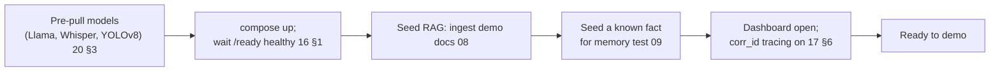
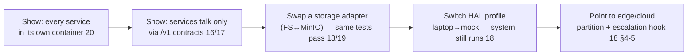
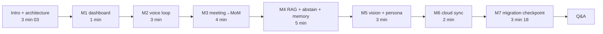

# 22 — Final Demo Plan

**Phase:** 15 — Deployment (capstone)
**Purpose:** Provide the end-of-internship demonstration script and the **acceptance run** that proves it. Every demo beat maps to a success metric from `01 §8` and the persona it serves, so the demo *is* the acceptance test — not a separate, prettier thing.

---

## Purpose

Show the complete AI Assistant Robot working end-to-end on the laptop ("Robot Brain"), in the order the system was built, and verify each primary feature against its target. The demo doubles as sign-off: walking the script green = passing acceptance.

## Scope

In: demo environment + setup, the persona-driven demo narrative, the per-beat acceptance mapping, the migration-readiness checkpoint, timing, and the fallback plan. Out: feature internals (module docs), test mechanics (`19`). Validates the success metrics in `01 §8` and the milestone outcomes M1–M7 in `01 §9` / `02`.

---

## 1. Demo environment & pre-flight

Stage-1 stack on one machine via `docker compose` (`20 §2`), HAL profile `laptop` (`18`), using laptop mic/camera/speakers + the Streamlit dashboard.



| Pre-flight item | Why |
|---|---|
| Models pre-cached in volumes | Avoid multi-GB pulls live (R-O4, `21`) |
| `compose up` rehearsed; all `/ready` green | No service accepts traffic before dependencies ready (`16 §1`) |
| Demo doc corpus ingested | Grounded-QA beat has real sources to cite (`08`) |
| One memory fact pre-stated (prior session) | Memory-persistence beat is verifiable across sessions (`09`) |
| Camera framed on a few known objects | Vision beat returns expected detections (`10`) |
| Backup recording prepared | Fallback if a live device fails (§6) |

## 2. Demo narrative (in development order)

The demo follows the build order (M1→M7), told through the three personas from `01`.

```mermaid
sequenceDiagram
    autonumber
    participant Op as Operator (you)
    participant Sys as AI Assistant
    participant Priya as Priya (Team Lead)
    participant Arjun as Arjun (IC)

    Note over Op,Sys: M1 — show dashboard: all services healthy 12
    Priya->>Sys: "Hey — what's on the agenda?" (wake + voice loop)
    Sys-->>Priya: spoken answer (expression: think→speak 11)
    Note over Priya,Sys: M2 — voice loop end-to-end 04/05/14
    Priya->>Sys: "Start recording the meeting."
    Sys-->>Priya: confirms; records (async) 06
    Priya->>Sys: "Stop recording."
    Sys-->>Priya: transcript + summary + MoM PDF ready 07
    Note over Priya,Sys: M3 — meeting → MoM
    Arjun->>Sys: "What did we decide about the launch date?"
    Sys-->>Arjun: grounded answer w/ source citation 08
    Arjun->>Sys: "What does the security policy say about X?" (not in corpus)
    Sys-->>Arjun: abstains — "I don't have that in my sources" 08
    Note over Arjun,Sys: M4 — grounded QA + abstention
    Op->>Sys: (new session) "What's my preferred summary format?"
    Sys-->>Op: recalls preference stated earlier 09
    Note over Op,Sys: M4 — long-term memory
    Op->>Sys: "What do you see?"
    Sys-->>Op: lists detected objects (detections, not video) 10
    Note over Op,Sys: M5 — perception + persona
    Op->>Sys: trigger cloud sync from dashboard 13
    Sys-->>Op: sync status; artifacts backed up
    Note over Op,Sys: M6 — ops + cloud
```

| Beat | Persona | Feature(s) | Milestone |
|---|---|---|---|
| Dashboard health | Operator | Dashboard, health (`12`,`16`) | M1 |
| Wake + ask + spoken reply | Priya | Voice loop, STT, LLM, TTS, Expression (`04`,`05`,`14`,`11`) | M2 |
| Record → transcript → summary → MoM PDF | Priya | Meeting suite (`06`,`07`) | M3 |
| Grounded answer with citation | Arjun | RAG (`08`) | M4 |
| Abstain when unsupported | Arjun | RAG abstention (`08`) | M4 |
| Recall preference next session | Operator | Long-term memory (`09`) | M4 |
| "What do you see?" | Operator | Object detection (`10`) | M5 |
| Trigger cloud sync | Operator | Cloud integration (`13`) | M6 |

## 3. Acceptance mapping (the demo *is* the test)

Each beat is checked against the exact success metric from `01 §8`.

| Success metric (`01 §8`) | Demo beat | Pass condition | Target |
|---|---|---|---|
| Voice loop end-to-end | Wake → ask → spoken answer | Audible grounded reply | ≤ NFR-LAT-1 (≤2.0s p50 / ≤3.5s p95, 8B GPU) |
| Meeting → MoM | Record → stop | Transcript + summary + **PDF** produced | 100% on demo meeting |
| Grounded QA | Launch-date question | Answer **cites** source doc/section | ≥ NFR-ACC-1 (≥90% faithfulness) |
| (negative) Abstention | Out-of-corpus question | Says it lacks the info; no fabrication | Abstains correctly |
| Memory persistence | New-session recall | Earlier-stated preference honored | Verified |
| Vision query | "What do you see?" | Correct known objects listed | ≥0.8 mAP-class items present |
| Migration readiness | §4 checkpoint | Each service runs in a container behind its API | All services |

The faithfulness (≥90%) and action-item recall (≥80%) numbers are demonstrated *live as a beat* but **certified by the eval harness** (`19 §3`) run just before the demo — the live beat shows it works; the eval proves the threshold.

## 4. Migration-readiness checkpoint (Stage-2 proof, on the laptop)

The final acceptance item is proving the system is *ready* to become a robot — without any robot present.



| Checkpoint | Demonstrates |
|---|---|
| Containerized services | AD-5 — deployment unit is portable (`20`) |
| Contract-only coupling | Services are relocatable (`16`,`17`) |
| Adapter swap, tests green | Portability is real, not claimed (NFR-PORT-1, `13`,`19 §4`) |
| HAL profile switch | Hardware is a swappable detail (`18`) |
| Edge/cloud + escalation hook | Stage-2 design is concrete (`18 §4–5`) |

This is what turns "we built it on a laptop" into "it is engineered to become a robot without a redesign" — the prime directive of the whole project.

## 5. Timing (≈20–25 min)



Order matters: it mirrors the development sequence (`02`), so the audience sees the system the way it was built — foundation first, capabilities layered on, migration-readiness last.

## 6. Fallback plan (R-O4, `21`)

| Failure on the day | Fallback |
|---|---|
| Mic/camera device glitch | Switch HAL to a fixture (`mock` audio/video) and continue (`18`) |
| Model not loaded / slow | Use pre-cached volume; if needed, smaller model via config (`20 §3`) |
| A service unhealthy | Orchestrator degrades that capability; narrate graceful degradation (`14 §6`) |
| Live network down | Cloud-sync beat uses local object store; system stays fully functional offline (`13`) |
| Total stack failure | Play the rehearsed backup recording of the full run |

Every fallback is itself a designed property (degradation, mocks, offline-first) — so even the recovery story reinforces the architecture.

## Design decisions

- **The demo is the acceptance test** — each beat maps to a `01 §8` metric, so a successful walkthrough *is* sign-off; there's no separate, softer "demo" standard.
- **Told in build order, through personas** — following M1→M7 and Priya/Arjun/Operator shows the system was engineered in a deliberate sequence and serves real users, not a pile of disconnected features.
- **Abstention is a headline beat** — deliberately asking something out-of-corpus and getting "I don't know" demonstrates the anti-hallucination guarantee (`08`, R-A1) as a *feature*, which is more convincing than only showing successes.
- **Live beat + offline eval** — quality thresholds (≥90% / ≥80%) are shown live but certified by the eval harness (`19`), separating "looks like it works" from "meets the bar."
- **Migration checkpoint without hardware** — proving portability via adapter/HAL swaps on the laptop is what substantiates the Stage-1→Stage-2 claim at demo time.

## Technology choices

| Need | Choice | Why |
|---|---|---|
| Bring-up | `docker compose` | One-command, rehearsable stack (`20`) |
| Front-of-room view | Streamlit dashboard | Shows health, transcripts, memory, detections live (`12`) |
| Tracing during demo | `corr_id` per interaction | Reassemble any flow if asked (`17 §6`,`19`) |
| Certification | Eval harness (`19`) | Proves NFR-ACC-1/2 thresholds objectively |
| Fallback | Mock HAL + backup recording | Device-independent recovery (`18`,`21`) |

## Future scalability considerations

- **Stage-2 demo**: same script on the actual robot (`robot` HAL profile) with the heavy tier in the cloud (`18`,`20`) — the narrative is unchanged, only the hardware moves.
- **Live escalation demo**: once the confidence-escalation hook (`18 §5`) is active, add a beat where a hard question escalates edge→cloud.
- **Fleet/ops demo**: dashboard across multiple robots; OTA update of one unit (`20`).
- **Continuous acceptance**: wire these beats as scheduled e2e scenarios (`19`) so "demo-ready" is always true, not a one-time scramble.

## Implementation notes

- Rehearse the full `compose up` → `/ready` → seed sequence at least once end-to-end before the demo; cold model pulls are the most common live failure (`21`).
- Run the eval harness (`19 §3`) immediately before the demo and have the score sheet on hand — it's the evidence behind the live quality beats.
- Keep the out-of-corpus question genuinely out of the corpus; verify beforehand that the system abstains rather than guesses (`08`).
- Confirm the memory fact was stated in a *prior* session so the persistence beat truly crosses a session boundary (`09`).
- Have the `mock` HAL profile one config switch away (`18`) so a device glitch doesn't stop the demo.
- Narrate the migration checkpoint (§4) explicitly as the project's thesis — it's the difference between a laptop app and a robot brain.
